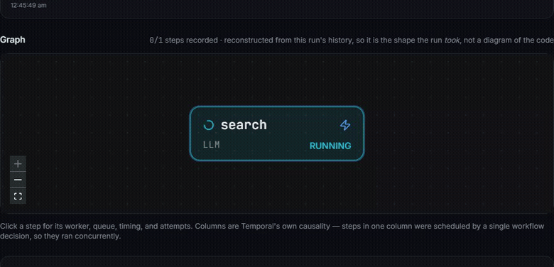
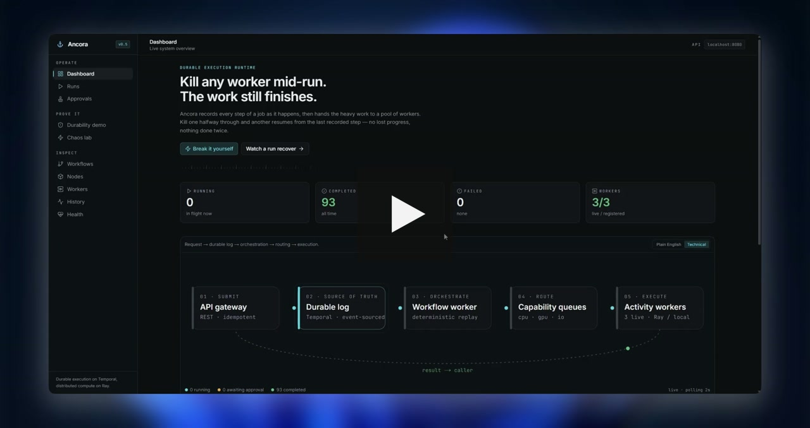
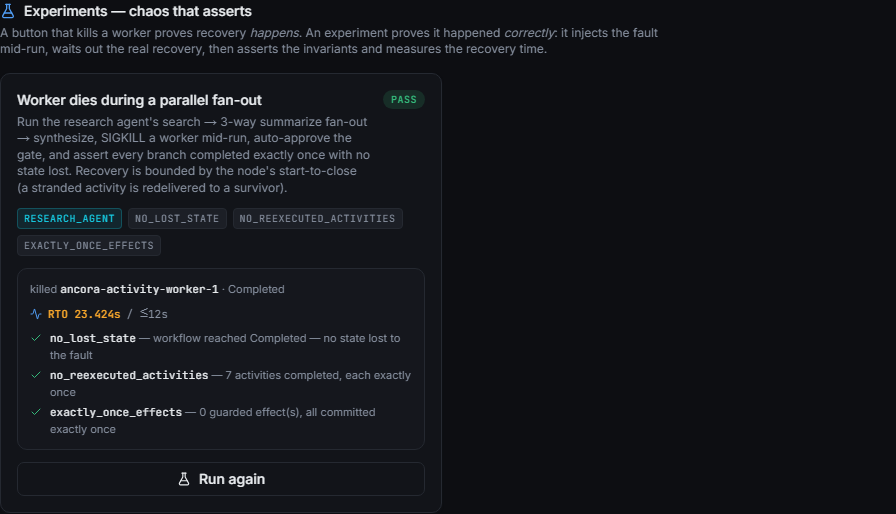
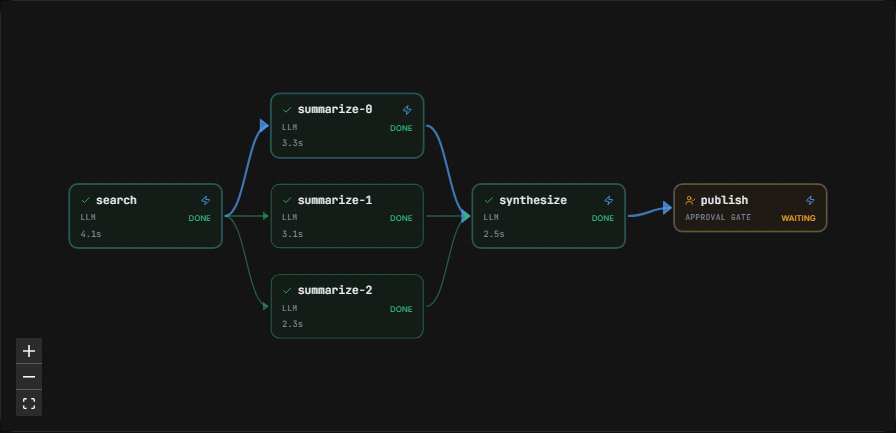
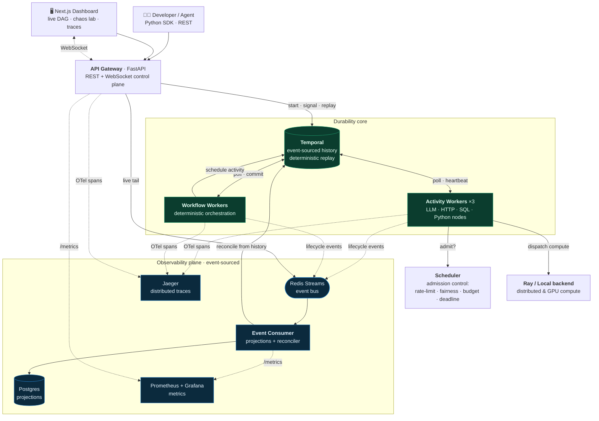

<h1 align="center">⚓ Ancora</h1>

<p align="center"><b>A fault-tolerant runtime for durable AI workflows.</b></p>
<p align="center"><i>Kill any worker, mid-run — and prove, automatically, that zero state was lost and zero effects fired twice.</i></p>

<p align="center">
  
  
  
  
  
  
  
  
</p>

<p align="center">
  <a href="https://youtu.be/UVKmMZnP50A"><b>▶ Watch the demo (2:38)</b></a> ·
  <a href="#-the-30-second-demo">Demo</a> ·
  <a href="#-architecture">Architecture</a> ·
  <a href="#-what-makes-this-hard">What makes it hard</a> ·
  <a href="#-quickstart">Quickstart</a> ·
  <a href="docs/RFC-0001-durable-ai-runtime.md">RFC</a>
</p>

<p align="center">
  
  <br><sub><i>The dashboard reconstructing a run's execution graph <b>live</b> from Temporal history — real fan-out, fan-in, critical path, and per-node timing.</i></sub>
</p>

---

Modern AI pipelines are brittle. An LLM call 500s, a GPU worker OOMs, a provider rate-limits, a pod is evicted — and a multi-step, multi-dollar computation vanishes. **Ancora makes that loss structurally impossible.** Every side-effecting step is recorded as an immutable event; if anything dies, execution replays to *exact state* and continues where it stopped — with the heavy work fanned out across distributed CPU/GPU workers.

It combines **Temporal** (durable, event-sourced execution) with **Ray** (distributed compute) behind one AI-native programming model — and wraps the whole thing in observability and chaos tooling you'd normally only find in a mature platform team.

> Ancora is **not** an agent framework. It's the fault-tolerant runtime that belongs *underneath* one.

---

## 🎬 The 30-second demo

<p align="center">
  <a href="https://youtu.be/UVKmMZnP50A">
    
  </a>
  <br><sub><i><b><a href="https://youtu.be/UVKmMZnP50A">▶ Watch the full walkthrough (2:38)</a></b> — the running system, end to end. Nothing mocked: every graph is reconstructed from Temporal's real event history, every kill is a real <code>SIGKILL</code>. <a href="https://youtu.be/UVKmMZnP50A?t=121">Jump to the chaos experiment at 2:01</a>.</i></sub>
</p>

The pitch of a durable runtime is "kill a worker, the run survives." Easy to *claim*, hard to *prove*. So Ancora ships a **chaos engine that asserts**: it starts a run, SIGKILLs a real worker container mid-flight, waits out the actual recovery, then **machine-checks the invariants** and **measures the recovery time**.

<p align="center">
  
</p>

One click →

- a real `SIGKILL` lands on a live activity-worker container mid-run,
- a **surviving replica** picks up the stranded work,
- the run reaches **`Completed`**, and
- three invariants are **verified from Temporal's own history**, not asserted on faith:

| Invariant | What it proves |
| --- | --- |
| ✅ **no lost state** | the run survived the fault and finished |
| ✅ **no re-executed activities** | every completed step is a durable checkpoint — a kill never re-runs it (`7 activities, each exactly once`) |
| ✅ **exactly-once effects** | no side-effecting node's idempotency guard was left half-committed |

…with the **recovery time (RTO)** measured against an SLO. Making recovery *fast* is a first-class feature: activities heartbeat, so a killed worker is detected in **~6 seconds** instead of waiting out a 60-second timeout — a **9.5× improvement** that turns the demo from an awkward wait into an instant recovery.

This is a **regression test you can watch** — the same invariant checkers run as pure unit tests in CI against synthetic post-kill histories.

---

## 🧭 The graph a run *actually executed*

A workflow here is ordinary Python that decides step-by-step what to schedule — so its DAG is *emergent*: the fan-out width comes from the input, the tail depends on the branch taken. Ancora **reconstructs the real graph from Temporal's history** (not a static diagram), with live per-node state, retries collapsed to one vertex, the **critical path** highlighted, and human-approval gates drawn as first-class stops.

<p align="center">
  
</p>

The columns are **exact**, not a timing guess: every activity's scheduled event names the workflow task that commanded it, so vertices in one column were genuinely decided together (a real fan-out), and a later column genuinely waited on the earlier results.

---

## 🏛 Architecture



**The load-bearing seams:**

- **Durability core (Temporal).** Every non-deterministic, side-effecting step is an immutable event. Deterministic replay reconstructs exact state after any crash. Retries, timers, signals, and human-in-the-loop gates are all durable.
- **Compute core (Ray).** Heavy/GPU work is dispatched off the orchestration path, with **async completion** for long jobs so a dispatcher slot is never held hostage by a 10-minute compute.
- **The governor (Scheduler).** Temporal guarantees a node *eventually* runs, exactly once. It has no opinion on whether running it **now** is wise. The scheduler decides that against rate limits, queue watermarks, tenant fair-shares, budgets, and deadlines — expressing "not yet" as a **durable deferral**, not a dropped request.
- **The observability plane (event-sourced).** Workers emit lifecycle events to Redis Streams; a consumer projects them to Postgres and the dashboard **animates the DAG live over WebSocket** — while a reconciler heals the projections from Temporal history, the source of truth.

---

## ✨ What's inside

| | |
| --- | --- |
| 🛡 **Durable execution** | Kill any worker at any step; the run replays to exact state and continues. Verified end-to-end, not just claimed. |
| 🧪 **Chaos that *asserts*** | Named fault-injection experiments that SIGKILL real containers and machine-check `no-lost-state` / `no-re-execution` / `exactly-once` + measure RTO. |
| ⚡ **Fast failover** | Activity heartbeats cut kill-detection from ~60 s to ~6 s (9.5×). |
| 🧭 **History-reconstructed DAG** | The graph a run *executed* — exact fan-out, live state, retries collapsed, critical path, approval gates. |
| 🔭 **Distributed tracing** | One unbroken OTel trace spans `API → workflow → activity → compute → provider`, including across the Ray/process boundary. |
| 📊 **Event-sourced projections** | Interceptor → Redis Streams → consumer → Postgres, with a reconnect-safe live WebSocket and a from-history reconciler. |
| ⏱ **Time-travel + replay** | Scrub a run's recorded event log; re-run its history through the current code to prove determinism still holds. |
| 🎛 **Admission scheduler** | 5 governors (deadline → budget → backpressure → fairness → rate-limit) that turn overload into durable, zero-cost waiting. |
| 🧩 **Built-in node library** | LLM, HTTP, SQL, Python (allow-listed + subprocess-isolated) — each with declared resources, cost, and a sandbox tier. |
| ✅ **Exactly-once effects** | An idempotency inbox makes a double-fired HTTP POST fire once — even across a mid-effect crash. |
| 💸 **Cost & recovery views** | Per-node/model/provider cost rollups; a recovery timeline that explains *why* a parked run isn't moving. |
| 📈 **Metrics & dashboards** | Hand-rolled Prometheus `/metrics` on every service + provisioned Grafana. |

---

## 🔩 What makes this hard

The parts that were genuinely difficult — and the engineering decisions behind them:

<details>
<summary><b>Reconstructing a run's DAG without a single timing heuristic</b></summary>

<br>The naive way to draw "these ran in parallel" is to compare timestamps — and it's a *flattering lie*: a fan-out drawn as a chain looks perfectly reasonable to anyone who hasn't read the code. Ancora instead reads Temporal's own causality: every `ActivityTaskScheduled` event names the `workflow_task_completed_event_id` that commanded it. Activities sharing that id were decided *together* (a real fan-out); a later workflow task means the workflow only decided once earlier results were in hand. The columns are **exact**, and no layout library is involved — so the graph never drifts between polls.
</details>

<details>
<summary><b>Keeping one trace unbroken across the Ray/process boundary</b></summary>

<br>Temporal's OTel interceptor carries context across the workflow→activity hop. But a compute function is *pickled and shipped to another process* — OTel's ambient context doesn't travel with it, so the compute span would orphan into its own root trace. The fix: inject the W3C `traceparent` into a plain dict, send it *as data* alongside the function, and re-extract it inside the worker. Contextvars don't even cross a thread-pool boundary, so this is required for the local backend too. The result is a single trace tree from the API root all the way to the provider call.
</details>

<details>
<summary><b>Proving "exactly-once" survives a crash <i>mid-effect</i></b></summary>

<br>A unique key structurally forbids two rows per effect. The risk a kill actually introduces is the *other* direction: an effect that began (row written `pending`) but whose worker died before committing the result — a stale `pending` a retry could re-fire. The chaos engine asserts every guarded effect reached `done`, so a half-committed side effect fails the experiment instead of silently double-firing in production.
</details>

<details>
<summary><b>Fast failover: detection vs. the timeout</b></summary>

<br>Without heartbeats, a killed worker's activity is only noticed at `start_to_close` (up to 60 s). Ancora's `run_node` emits a heartbeat every 2 s under a ~6 s `heartbeat_timeout`, so a *dead* worker is detected in seconds while a *slow* one is never mistaken for dead. (This also fixed a latent bug: a policy declared a 30 s heartbeat timeout but nothing ever emitted heartbeats — any long node would have falsely timed out.)
</details>

<details>
<summary><b>Durability ≠ liveness</b></summary>

<br>Temporal guarantees your *state* survives any worker death. It cannot manufacture *progress* from no capacity — a stranded activity only finishes if some worker polls its queue. So fault tolerance is redundancy: Ancora runs a pool of activity workers, and killing one lets the survivors recover automatically. A separate subtlety: a `SIGKILL` skips graceful deregistration, orphaning worker-registry rows — so a reaper prunes them, and the fleet view never lies about how much capacity is actually live.
</details>

<details>
<summary><b>Temporal writes <code>ActivityTaskStarted</code> lazily</b></summary>

<br>The event for an attempt is only written when it reaches a *terminal* state — so the attempt running *right now*, including one stranded on a just-killed worker, is absent from history entirely. Reading history alone draws it as "still queued," which is backwards. The recovery view folds in `describe().pending_activities` to see the present, and distinguishes three waits that look identical from outside: *queued* (free), *detecting* (an attempt stranded on a dead process), and *backoff* (retry policy).
</details>

---

## 🚀 Quickstart

**Prerequisites:** [Docker](https://docs.docker.com/get-docker/) + Docker Compose.

```bash
git clone https://github.com/ancora/ancora.git && cd ancora
make up          # full stack: Temporal, Postgres, Redis, 3 workers, scheduler, observability
```

Then open:

| URL | What |
| --- | --- |
| **<http://localhost:3000>** | The Ancora dashboard — runs, live DAG, **Chaos Lab** |
| <http://localhost:3000/chaos> | Kill a worker, or run an asserting experiment |
| <http://localhost:8080/docs> | REST API (OpenAPI) |
| <http://localhost:16686> | Jaeger — distributed traces |
| <http://localhost:3001> | Grafana — metrics dashboards |
| <http://localhost:8233> | Temporal Web |

Drive it from the terminal:

```bash
# Start a fan-out research workflow (search → 3× summarize → synthesize → human gate)
curl -sX POST localhost:8080/v1/workflows/research_agent/runs \
  -H 'content-type: application/json' -d '{"input":{"topic":"durable execution"}}'

# Run a chaos experiment: kill a worker mid-run and assert it recovered correctly
curl -sX POST localhost:8080/v1/chaos/experiments/fan-out-failover | jq
```

The optional **Ray head** (distributed/GPU backend) is behind a profile — without it, activity workers use the in-process local backend, so no Ray is required for dev or CI:

```bash
docker compose -f deploy/docker/docker-compose.yml --profile ray up --build
```

<details>
<summary><b>More Docker commands</b></summary>

<br>

```bash
C="docker compose -f deploy/docker/docker-compose.yml"
$C ps                        # what's running / crashed
$C logs -f api               # tail one service
$C up -d --build activity-worker   # rebuild + restart one service
$C down        # stop  ·  add -v to also wipe the Postgres volume
```

Chaos injection needs the Docker socket, so it is **off unless `ANCORA_CHAOS_ENABLED=true`** (which the local stack sets and nothing else should) and scoped to this Compose project + an allow-list of worker services.
</details>

---

## 🧩 The node library

Workflows orchestrate; **nodes** do the side-effecting work, inside activities, so Temporal can retry and replay them safely. Five ship built in — browse them with JSON schemas at `GET /v1/plugins` or the dashboard's **Nodes** view:

| Node | What it does | Notes |
| --- | --- | --- |
| `llm` | Chat/completion across providers | Primary→secondary fallback chain; token/cost accounting; mock provider for CI |
| `http` | REST call with templating | Honours `Retry-After`; 4xx terminal, 5xx/429 transient |
| `database` | One parameterized statement | Named datasources only; bound params only; read/write split |
| `python` | A registered Python callable | Allow-listed by name, never an importable path; optional subprocess + memory cap |
| `approval` | Durable human gate | Resolved by signal in workflow code; optional expiry branch |

Admission policy — provider rate limits, queue watermarks, tenant weights, budgets — lives in [`deploy/scheduler/policy.yaml`](deploy/scheduler/policy.yaml) and is hot-reloaded on save. The worker-side client **fails open**: if the scheduler is down, nodes are admitted anyway — admission control protects providers, it must never halt a durable fleet.

---

## 🗺 API surface

<sub>REST + WebSocket, all under `/v1`.</sub>

```
Runs        POST /workflows/{name}/runs   GET /runs   GET /runs/{id}
            POST /runs/{id}/cancel        POST /runs/{id}/signals/{name}
Observe     GET /runs/{id}/graph          GET /runs/{id}/history      GET /runs/{id}/recovery
            GET /runs/{id}/cost           GET /runs/{id}/retries      POST /runs/{id}/replay
Live        WS  /stream/runs/{id}         WS  /stream/workers
Fleet       GET /workers                  GET /queues
Human loop  GET /approvals                POST /approvals/{id}/decision
Chaos       GET /chaos                    POST /chaos/inject
            GET /chaos/experiments        POST /chaos/experiments/{name}
Catalog     GET /plugins                  GET /workflows
Ops         GET /healthz  GET /readyz  GET /metrics
```

---

## 🧱 Repository layout

```
packages/sdk-python/        ancora — workflow / activity / node authoring SDK + node library
packages/common/            shared server library — ORM, event bus, tracing, metrics, registry
packages/cli/               ancora — command-line interface
services/api-gateway/       FastAPI: REST + WebSocket control plane, chaos engine, replay
services/workflow-workers/  deterministic orchestration workers
services/activity-workers/  execution workers (nodes, Ray dispatch, heartbeats)
services/scheduler/         admission control: rate-limit, backpressure, fairness, budget
services/event-consumer/    event-sourced projections + reconciler + metrics
web/                        Next.js 14 dashboard — live DAG, chaos lab, recovery, traces
deploy/                     Docker Compose stack + Prometheus/Grafana provisioning
docs/                       RFC, architecture review, phased implementation plan
```

**Stack:** Python 3.11 · Temporal · Ray · FastAPI · Pydantic v2 · SQLAlchemy/Postgres · Redis Streams · OpenTelemetry · Prometheus/Grafana · Next.js 14 + React Flow · Docker Compose · `uv` workspace · mypy strict · ruff · pytest.

---

## ✅ Quality bar

- **284 passing tests** (unit + Temporal integration) with `pytest`, plus Playwright UI smoke tests.
- **mypy `--strict`** and **ruff** clean across the entire workspace.
- **Every subsystem ships a replay test** (durability) and, where it touches failure, **a chaos assertion**.
- Correctness properties (DAG causality, exactly-once, chaos invariants, RTO, trace propagation) are pinned against **synthetic histories**, so they run in CI without a live cluster.

```bash
make install                 # uv sync + pnpm install
make lint typecheck test     # the CI gate, locally
```

---

## 📈 Status & roadmap

Built in vertical, releasable slices — every phase ends with a working, demoable, tested stack.

- ✅ **Durable core** — start a workflow, run activities, kill a worker mid-run and resume.
- ✅ **Execution runtime + Ray bridge** — async completion, heartbeat-checkpointing, worker fleet.
- ✅ **Scheduler + node library + idempotency** — 5 governors, built-in nodes, exactly-once inbox.
- ✅ **Observability** — event-sourced projections, live DAG over WebSocket, distributed tracing, metrics, replay, critical-path.
- 🟡 **Plugins + Chaos engine** — asserting chaos experiments ✅ + fast failover ✅; signed third-party plugins next.
- ⏭ **Next:** Kubernetes deployment (Helm/KubeRay/KEDA), OIDC/RBAC + tenant isolation, declarative SDK + LangGraph adapter.

See the [phased implementation plan](docs/IMPLEMENTATION-PLAN.md) and [RFC-0001](docs/RFC-0001-durable-ai-runtime.md) for the full design.

---

<p align="center"><sub>Built around the boring guarantee that makes AI workflows trustworthy: <b>nothing is lost, and nothing happens twice.</b></sub></p>
<p align="center"><sub><a href="LICENSE">Apache-2.0</a></sub></p>
