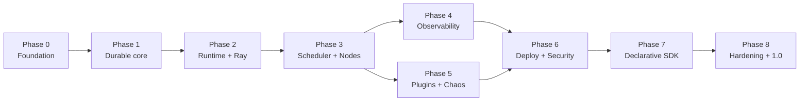

# Ancora — Implementation Plan (Phased Delivery)

> **Role:** Tech Lead · **Inputs:** RFC-0001 + RFC-0001a (source of truth) · **Principle:** every phase ends with the repository in a **working, demoable, tested** state. No phase leaves a broken build or a half-wired subsystem.

## Phasing philosophy

- **Vertical slices, not horizontal layers.** Phase 1 already runs a durable workflow end-to-end (even if trivial). We do not build "all of the backend" then "all of the UI."
- **Each phase is releasable.** Tag `v0.1`…`v0.9`. A user could clone at any tag and run *something* real.
- **The durability proof is front-loaded.** By end of Phase 3 you can kill a worker mid-run and watch recovery — that is the whole pitch, so it comes early.
- **Difficulty legend:** S ≈ ≤1 day · M ≈ 2–4 days · L ≈ 1–2 weeks · XL ≈ multi-week/multi-issue.

---

## Phase 0 — Foundation & Walking Skeleton  → tag `v0.1`

**Goal:** an empty-but-real monorepo where `docker compose up` starts Temporal + Postgres + a FastAPI health endpoint + a Next.js shell, and CI is green.

- **Deliverables:** monorepo scaffold; Compose stack (Temporal, Postgres, Redis, API, web); CI (lint, type-check, test, build); pre-commit; `ancora` CLI stub; ADR/RFC docs wired.
- **Components:** `services/api-gateway`, `web/`, `packages/sdk-python`, `packages/cli`, `deploy/docker`.
- **Technologies:** Python 3.11, FastAPI, Pydantic v2, `uv`/Poetry, Temporal dev server, Postgres 15, Redis 7, Next.js 14, TypeScript, Tailwind, shadcn/ui, GitHub Actions.
- **APIs:** `GET /healthz`, `GET /v1/version`.
- **DB changes:** initial migration framework (Alembic); `org`, `project`, `user` tables.
- **UI changes:** app shell, nav, dark theme, health page hitting the API.
- **Testing:** CI runs unit tests + lint + `tsc`; one API test; one web smoke test (Playwright) that loads the shell.
- **Definition of Done:** `docker compose up` → dashboard shell loads, `/healthz` green, CI green on `main`, README quickstart works on a clean clone.

---

## Phase 1 — Durable Core: run a workflow  → tag `v0.2`

**Goal:** start a real Temporal workflow from the API and watch it complete. No Ray yet; activities run inline.

- **Deliverables:** Temporal worker service; minimal SDK (`@workflow`, `self.call`, `@activity`); start/query/list runs via API; a "hello" workflow with 3 sequential activities.
- **Components:** `services/workflow-workers`, `services/workflow-service`, `packages/sdk-python` (core).
- **Technologies:** Temporal Python SDK.
- **APIs:** `POST /v1/workflows/{name}/runs`, `GET /v1/runs/{id}`, `GET /v1/runs`, `POST /v1/runs/{id}/cancel`.
- **DB changes:** `workflow_def`, `workflow_version`, `workflow_run` (projection, populated crudely by polling for now — replaced in Phase 4).
- **UI changes:** run list page; run detail (status, input/output).
- **Testing:** integration test spins Temporal dev server, starts a workflow, asserts completion; replay test harness introduced.
- **Definition of Done:** `POST` a run → it executes 3 activities → `Completed`; visible in UI; replay test passes; killing the worker mid-run and restarting it resumes to completion (durability smoke test).

---

## Phase 2 — Execution Runtime + Ray Bridge  → tag `v0.3`  *(RFC-0003, RFC-0004)*

**Goal:** activities dispatch to Ray; long activities use **async completion**; worker lifecycle is real.

- **Deliverables:** activity-worker service; Ray integration; **async activity completion** path; heartbeat-checkpointing; cooperative cancellation; graceful drain; worker registration/discovery; capability→queue routing (gpu/cpu/io queues exist).
- **Components:** `services/activity-workers`, worker registry (in `plugin-registry`/`workflow-service`), Ray head in Compose.
- **Technologies:** Ray, Temporal async completion (`complete_activity`), Temporal heartbeats.
- **APIs:** `GET /v1/workers`, `GET /v1/queues`.
- **DB changes:** `worker` registry table; `node_execution` (still crude projection).
- **UI changes:** Worker view (pools, utilization, registered capabilities); queue depth widget.
- **Testing:** integration test: long activity → async-handed-off → Ray completes → workflow resumes; kill activity worker (inline) → retry; kill activity worker (async) → no re-run; checkpoint resume test.
- **Definition of Done:** a workflow with a 30s "GPU-ish" activity runs via async completion; dispatcher slot is freed during compute (asserted); worker drains cleanly on SIGTERM; killing workers mid-run recovers with the correct dup-safety per §8 scenarios 1–3.

---

## Phase 3 — Scheduler + Built-in Nodes + Idempotency  → tag `v0.4`  *(RFC-0002)*

**Goal:** the durability *proof* is complete and the node library is usable.

- **Deliverables:** Scheduler service (admission, capability routing, per-provider **rate-limit** via Redis token buckets, **backpressure** via queue watermark → defer, fair-queue weights; budget/deadline **stubbed** with interfaces); built-in nodes **LLM, HTTP, Python, Database, Approval**; inbox idempotency table; retry policies per node class; provider fallback chain for LLM.
- **Components:** `services/scheduler`, node library in `packages/sdk-python/nodes`.
- **Technologies:** Redis (token buckets, locks), provider SDKs (mock provider for CI).
- **APIs:** `POST /v1/runs/{id}/signals/{name}`, `GET /v1/approvals`, `POST /v1/approvals/{id}/decision`, `POST /v1/chaos/inject` (basic), `GET /v1/runs/{id}/cost` (from returned costs).
- **DB changes:** `inbox` (idempotency), `retry_attempt`, `approval_gate`, `cost_ledger`.
- **UI changes:** DAG view (React Flow) with node states; node inspector (logs/input/output/retries); Approval inbox + approve/reject.
- **Testing:** rate-limit governor prevents 429 storm (scenario 9); backpressure defers under load; idempotent side-effect test (HTTP node fired twice → one effect); human-gate durable wait test (scenario 12); LLM fallback test.
- **Definition of Done:** end-to-end research-agent example runs (search→summarize×N→synthesize→approve→publish); rate-limits/backpressure demonstrably work; **kill any worker at any node → correct resume, zero dup effects** (the north-star metric from RFC-0001 §1).

---

## Phase 4 — Observability + Projections + Live UI  → tag `v0.5`  *(RFC-0006, RFC-0007)*

**Goal:** you can *see* everything live and after the fact.

- **Deliverables:** interceptor→Redis-Stream→consumer projection pipeline (replaces crude polling); OTel tracing with **context propagated across the Ray boundary**; Prometheus metrics catalog; Grafana dashboards; reconnect-safe WebSocket via Redis Streams; timeline/history replay UI; cost breakdown; critical-path bottleneck view.
- **Components:** `services/event-consumer`, `observability/`, WS layer in API gateway.
- **Technologies:** OpenTelemetry, Prometheus, Grafana, Redis Streams, Temporal interceptors.
- **APIs:** `WS /v1/stream/runs/{id}`, `WS /v1/stream/workers`, `GET /v1/runs/{id}/history`, `POST /v1/runs/{id}/replay`.
- **DB changes:** projections now authoritative for UI reads; reconciler job; visibility search wiring (Advanced Visibility optional).
- **UI changes:** live-animating DAG; history scrubber + replay; timeline; cost view; worker live metrics; DAG virtualization + minimap.
- **Testing:** trace spans span workflow→activity→ray→provider (asserted unbroken); reconnect replays missed events; projection reconciler rebuilds from history; bottleneck critical-path correctness test.
- **Definition of Done:** open a run mid-flight → DAG animates in real time; drop the WS → reconnect → no gaps; one trace links UI+logs+metrics+cost; Grafana shows RED/USE + cost.

---

## Phase 5 — Plugins + Chaos Engine  → tag `v0.6`  *(RFC-0005, RFC-0010)*

**Goal:** third parties can add nodes; chaos is a first-class, asserting feature.

- **Deliverables:** plugin contract + registry; isolation tiers **T0/T1** (Ray runtime-env dep isolation); resource limits + capability manifest; **Sigstore signing + verification**; Chaos engine with scenario library (1–9) + **invariant assertions** (0 lost state / 0 dup effects) + RTO measurement.
- **Components:** `services/plugin-registry`, `services/chaos-controller`.
- **Technologies:** Ray runtime environments, cosign/Sigstore, subprocess sandbox.
- **APIs:** `POST /v1/plugins`, `GET /v1/plugins`, `POST /v1/chaos/inject`, `GET /v1/chaos/experiments`.
- **DB changes:** `plugin`, `node_type`, `chaos_event`.
- **UI changes:** Plugin registry view (versions, tier, signature status, schema); Chaos Lab (scenario picker, blast-radius, live recovery timeline, expected-vs-actual RTO, pass/fail).
- **Testing:** custom plugin (cross-encoder rerank) registers + runs sandboxed with declared resources; unsigned plugin rejected; each chaos scenario 1–9 runs and asserts its invariant in CI (chaos regression suite).
- **Definition of Done:** a signed third-party node runs end-to-end in a workflow; Chaos Lab kills a Ray node mid-run and shows measured recovery + a green invariant assertion.

---

## Phase 6 — Production Deployment + Security  → tag `v0.7`  *(RFC-0008, RFC-0009)*

**Goal:** run it on Kubernetes with autoscaling and a real security posture.

- **Deliverables:** Helm charts; KubeRay operator integration + Ray autoscaler; KEDA activity-worker autoscaling on queue backlog; Postgres HA + Redis; secrets manager integration; OIDC/SSO login + RBAC (org/project/run scopes); tenant isolation (namespaces + queues); network policies; TLS/mTLS.
- **Components:** `deploy/helm`, `deploy/terraform` (optional), `services/api-gateway` (auth).
- **Technologies:** Kubernetes, Helm, KubeRay, KEDA, OIDC, cert-manager, external-secrets.
- **APIs:** auth on all endpoints; `POST /v1/auth/*`; API-key management.
- **DB changes:** `api_key`, RBAC tables; row-level project scoping.
- **UI changes:** login, org/project switcher, RBAC-gated actions, settings.
- **Testing:** Helm install on kind/k3d in CI; autoscale-up under load and scale-down with warm-model retention; authz matrix tests; secret never appears in history (asserted).
- **Definition of Done:** `helm install` on a fresh cluster → full stack healthy; load spike autoscales Ray + activity workers; unauthorized access denied; secrets sourced from manager, absent from history.

---

## Phase 7 — Declarative SDK + Budget/Deadline + v2 Nodes  → tag `v0.8`

**Goal:** the v2 developer surface and full scheduler.

- **Deliverables:** declarative DAG SDK + `g.compile()` → `dag_spec`; LangGraph adapter (compile a LangGraph to an Ancora workflow); budget + deadline scheduling fully enabled; retrieval + embedding nodes with Ray auto-batching; run comparison/diff UI (eval).
- **Testing:** a LangGraph graph runs durably on Ancora unchanged in behavior; budget hard-stop test; deadline cancellation test; auto-batching throughput test.
- **Definition of Done:** the same workflow authored declaratively and imperatively produce identical histories; budgets/deadlines enforced; a LangGraph example runs on Ancora.

---

## Phase 8 — Hardening, Docs, 1.0 Prep  → tag `v0.9` → `v1.0-rc`

**Goal:** production credibility.

- **Deliverables:** load/soak tests; failure-mode runbooks; full API reference (generated OpenAPI); SDK docs + tutorials; example gallery; upgrade/versioning guide; SBOM + release signing; contribution guide + governance.
- **Testing:** 24h soak with periodic chaos injection; chaos regression suite gating releases; performance benchmarks published.
- **Definition of Done:** soak passes with zero lost workflows; docs cover quickstart→production; `v1.0-rc` tagged; chaos suite green in CI.

---

## Cross-cutting engineering practices (all phases)

- **Trunk-based** with short-lived PRs; every PR: CI green + review + no drop in coverage on changed lines.
- **Every subsystem ships with a replay test** (durability) and, where it touches failure, **a chaos assertion**.
- **Migrations are forward-only and reversible-tested**; no destructive migration without a backfill.
- **Feature flags** for anything half-built so `main` is always releasable.
- **Docs-as-code:** the relevant RFC is merged *before* the phase's first implementation PR.
- **Observability is not a phase you bolt on** — every service emits structured logs + metrics + traces from its first commit (Phase 4 makes them *pretty*, not *present*).

## Dependency graph of phases

