# RFC-0001 — Ancora: A Fault-Tolerant Runtime for Durable AI Workflows

> **Status:** Draft · **Author:** Platform Engineering · **Reviewers:** TBD · **Target:** Open-source flagship (Apache-2.0)
> **Document type:** Combined PRD + Technical Design Document + Architecture Specification
> **Codename:** `Ancora` (Italian *anchor* — the thing that keeps a ship from drifting). Final product name TBD; every occurrence of *Ancora* is a placeholder.

---

## Table of Contents

1. [Executive Summary](#1-executive-summary)
2. [Vision](#2-vision)
3. [Problem Statement](#3-problem-statement)
4. [Competitive Analysis](#4-competitive-analysis)
5. [System Architecture](#5-system-architecture)
6. [Component Breakdown](#6-component-breakdown)
7. [Database Schema](#7-database-schema)
8. [Event Flow](#8-event-flow)
9. [Workflow Lifecycle](#9-workflow-lifecycle)
10. [Failure Recovery Lifecycle](#10-failure-recovery-lifecycle)
11. [State Machine](#11-state-machine)
12. [API Design](#12-api-design)
13. [SDK Design](#13-sdk-design)
14. [Plugin Architecture](#14-plugin-architecture)
15. [UI Wireframes](#15-ui-wireframes)
16. [Folder Structure](#16-folder-structure)
17. [Deployment Architecture](#17-deployment-architecture)
18. [Scaling Strategy](#18-scaling-strategy)
19. [Security Model](#19-security-model)
20. [Future Roadmap](#20-future-roadmap)
21. [Engineering Tradeoffs](#21-engineering-tradeoffs)
22. [Risks](#22-risks)
23. [Open Questions](#23-open-questions)
24. [Stretch Goals](#24-stretch-goals)

---

## 1. Executive Summary

**Ancora is a durable execution runtime for AI workloads.** It fuses two proven systems — **Temporal** for durable, event-sourced workflow orchestration and **Ray** for distributed, GPU-aware compute — behind a single programming model and control plane purpose-built for LLM agents and multi-step AI pipelines.

The thesis is narrow and deliberate: **AI applications are non-deterministic, long-running, expensive, and failure-prone, yet the orchestration layer beneath them is usually a `for` loop in a Python process.** When that process dies — an OOM on a GPU worker, a 90-second LLM timeout, a provider rate-limit storm, a pod eviction — the entire multi-thousand-token, multi-dollar computation is lost. Ancora makes that loss structurally impossible.

Ancora is **not** an agent framework. It is the runtime *underneath* agent frameworks. LangGraph, CrewAI, AutoGen, or a hand-rolled orchestration loop should be able to target Ancora as their execution substrate the way a web app targets a Kubernetes cluster.

**What we deliver:**

- A **workflow engine** with DAGs, conditional branches, parallel fan-out/fan-in, typed retry policies, checkpointing, deterministic replay, and workflow versioning — inherited from and enforced by Temporal's event-sourced core.
- An **execution engine** that offloads heavy, parallel, and GPU-bound work to Ray, with dynamic worker allocation, resource constraints, queueing, and autoscaling.
- A **first-class AI node library** (LLM, embedding, retrieval, tool-call, HTTP, DB, shell, human-approval) with built-in idempotency, cost accounting, and streaming.
- **Deep observability**: live workflow graph, per-node timelines, event stream replay, worker health, queue depth, GPU/CPU utilization, OpenTelemetry traces, Prometheus metrics.
- **Human-in-the-loop** gates that keep a workflow durably suspended (zero compute cost) for minutes, days, or weeks awaiting approval.
- A **Chaos Mode** control surface that injects real failures (kill worker, drop provider, timeout, GPU crash) so teams can *watch* recovery, not just trust it.

**Target users:** platform teams building agentic products, ML infra engineers running batch inference and evaluation pipelines, and framework authors who want durability without reimplementing event sourcing.

**Success metric for MVP:** a developer can express a 10-node agentic workflow in <50 lines of SDK code, kill any worker at any time, and observe the workflow resume to correct completion with no duplicated side effects and no lost state.

---

## 2. Vision

> **"Kubernetes made stateless services trivial to run reliably. Ancora makes stateful, long-running, expensive AI computations trivial to run reliably."**

Three-year vision:

1. **The default substrate for production agents.** When a team ships an AI agent to production and asks "what happens when this fails at step 7 of 12?", the answer is "Ancora already handled it."
2. **A portable programming model.** Workflows authored against the Ancora SDK run identically on a laptop (single-node dev mode), a single VM (Docker Compose), and a 500-GPU cluster (Kubernetes + Ray) with no code change.
3. **An observability standard for AI.** The Ancora dashboard becomes to AI workflows what the Temporal Web UI is to microservice orchestration and what the Ray dashboard is to distributed compute — the place you look when something breaks.

We measure the vision against a single north-star property: **durability is not a feature you opt into; it is the default and only mode of execution.**

---

## 3. Problem Statement

### 3.1 The failure surface of modern AI systems

A representative production agent — "research a topic, call three tools, synthesize, get human sign-off, publish" — touches every unreliable component in modern infrastructure at once:

| Failure class | Real-world trigger | Typical blast radius today |
|---|---|---|
| **LLM call failure** | 500 from provider, content-filter block, malformed JSON | Whole run aborts; partial work discarded |
| **Timeout** | Slow model, cold GPU, 120s+ generation | Client library gives up; retry re-runs *everything* |
| **Rate limiting** | 429 during traffic spike | Cascading retries amplify the storm |
| **Worker crash** | GPU OOM, pod eviction, node preemption | In-memory agent state gone |
| **Network partition** | Transient DNS/VPC blip | Half-committed side effects (email sent twice?) |
| **Process restart** | Deploy, autoscale-down, OOM-kill | Every in-flight workflow lost |
| **Human latency** | Approval takes 3 days | Process can't afford to hold a thread/socket that long |

The industry response has been to bolt retries onto individual calls. That is insufficient because **retries at the call level are not durable at the workflow level.** If the process holding the loop dies, no amount of `tenacity` decorators saves you. The *state of the computation* — which steps completed, what they returned, what side effects fired — lives in RAM and dies with the process.

### 3.2 Why existing tools don't close the gap

- **Agent frameworks (LangGraph, CrewAI, AutoGen)** optimize for *authoring* agent logic. Their persistence is a checkpoint bolt-on, not an event-sourced source of truth, and they have no distributed compute or resource scheduling story.
- **Durable orchestrators (Temporal, Prefect, Dagster, Airflow)** solve durability beautifully but are compute-agnostic: they schedule tasks, they don't *run* GPU inference. You still bring your own Ray/K8s and glue it together.
- **Compute engines (Ray)** solve distribution and GPU scheduling but have no durable, event-sourced workflow state. A Ray job that dies mid-DAG restarts from scratch.

**Nobody owns the seam.** Ancora is that seam: durable state (Temporal) *and* distributed compute (Ray) unified behind one AI-native programming model.

### 3.3 What "solved" looks like

A workflow is a **deterministic program whose every non-deterministic and side-effecting step is recorded as an immutable event.** Re-executing the program by replaying its event history reconstructs exact state without re-incurring side effects. Heavy steps run on elastic distributed workers. The developer writes ordinary-looking Python; the runtime provides the guarantees.

---

## 4. Competitive Analysis

### 4.1 Landscape map

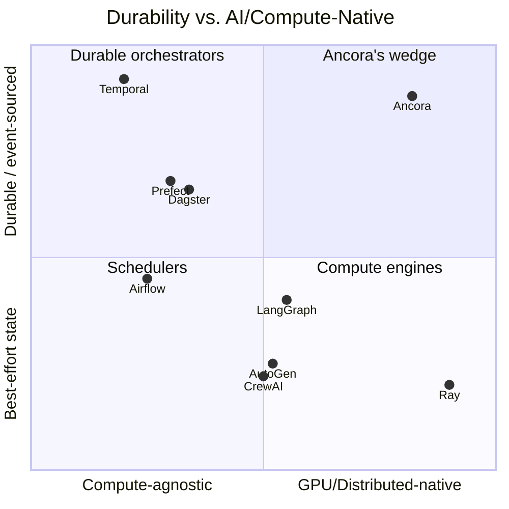

### 4.2 Feature comparison

| Capability | Temporal | Ray | LangGraph | CrewAI / AutoGen | Prefect | Dagster | Airflow | **Ancora** |
|---|---|---|---|---|---|---|---|---|
| Durable, event-sourced state | ✅ | ❌ | ⚠️ checkpoint | ❌ | ⚠️ | ⚠️ | ⚠️ | ✅ |
| Deterministic replay | ✅ | ❌ | ❌ | ❌ | ❌ | ❌ | ❌ | ✅ |
| Distributed / GPU compute | ❌ | ✅ | ❌ | ❌ | ⚠️ | ⚠️ | ❌ | ✅ |
| Autoscaling workers | ❌ | ✅ | ❌ | ❌ | ⚠️ | ⚠️ | ⚠️ | ✅ |
| Native LLM/agent nodes | ❌ | ❌ | ✅ | ✅ | ❌ | ❌ | ❌ | ✅ |
| Human-in-the-loop (durable wait) | ✅ | ❌ | ⚠️ | ⚠️ | ⚠️ | ❌ | ❌ | ✅ |
| Workflow versioning | ✅ | ❌ | ❌ | ❌ | ⚠️ | ✅ | ⚠️ | ✅ |
| Cost/token accounting | ❌ | ❌ | ⚠️ | ⚠️ | ❌ | ❌ | ❌ | ✅ |
| Chaos/failure injection UX | ❌ | ❌ | ❌ | ❌ | ❌ | ❌ | ❌ | ✅ |
| Live DAG + replay UI | ⚠️ | ⚠️ | ❌ | ❌ | ✅ | ✅ | ✅ | ✅ |

Legend: ✅ first-class · ⚠️ partial/possible-with-effort · ❌ absent

### 4.3 Where Ancora fits — explicitly

- **vs. Temporal:** Ancora *is built on* Temporal's durability core but adds the missing compute layer (Ray), an AI-native node library, and cost/token semantics. We are a Temporal *complement*, not a competitor — much like Airflow-on-K8s vs. raw K8s.
- **vs. Ray:** Ancora *is built on* Ray's compute core but adds durable state, replay, and human-in-the-loop. Ray answers "run this fast in parallel"; Ancora answers "run this reliably, forever, and never lose it."
- **vs. LangGraph/CrewAI/AutoGen:** These are *customers*, not competitors. Their graphs should compile to Ancora workflows. We deliberately do **not** ship opinionated agent-authoring ergonomics (prompt templating, memory abstractions, tool routing DSLs).
- **vs. Prefect/Dagster/Airflow:** These are data-engineering orchestrators optimized for scheduled batch DAGs over data assets. Ancora is optimized for *long-lived, interactive, non-deterministic, GPU-bound* AI computations with per-step durability and replay.

**One-line positioning:** *Ancora is to AI workflows what Kubernetes is to containers — the runtime, not the app.*

---

## 5. System Architecture

### 5.1 High-level topology

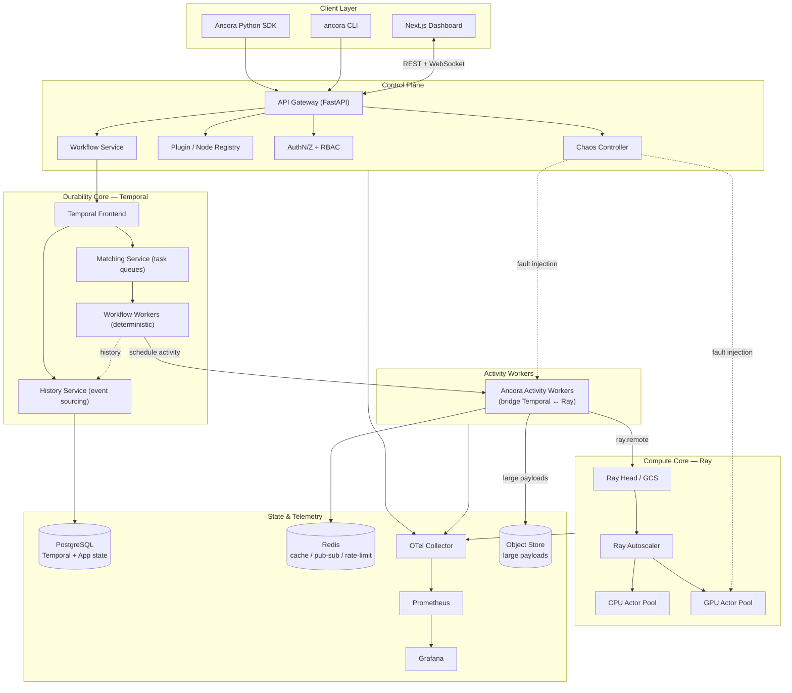

### 5.2 The central architectural idea — the Temporal/Ray bridge

The load-bearing design decision: **Temporal workflows are deterministic and must never do I/O directly; Ray is where non-deterministic heavy work happens.** We bridge them with a thin, durable **Activity** layer.

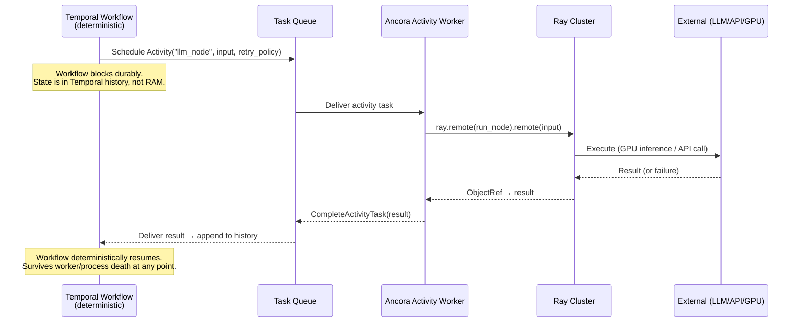

**Why this shape:** Temporal guarantees *exactly-once workflow progression* via event sourcing; Ray guarantees *efficient at-least-once compute*. The Activity boundary is the idempotency seam — activities carry an idempotency key so an at-least-once Ray execution never produces a duplicated externally-visible side effect.

### 5.3 Deployment view (Kubernetes)

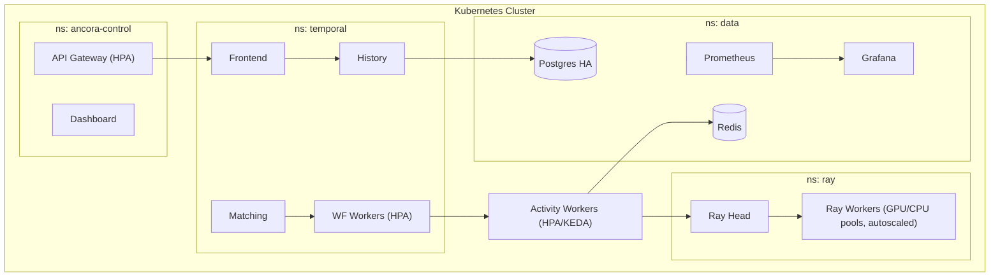

---

## 6. Component Breakdown

| Component | Responsibility | Tech | Scaling axis |
|---|---|---|---|
| **API Gateway** | REST + WebSocket entrypoint; request validation; auth; rate limiting; SSE/WS fan-out of live events | FastAPI, Pydantic, `uvicorn` | Stateless, HPA on RPS |
| **Workflow Service** | Translates API calls into Temporal client operations (start/signal/query/terminate); owns workflow metadata | Python, Temporal SDK | Stateless, HPA |
| **Node / Plugin Registry** | Catalog of node types (built-in + custom); schema validation; versioning; sandbox policy | Python, Postgres-backed | Stateless |
| **Temporal Frontend** | gRPC entrypoint to durability core; auth passthrough; rate limiting | Temporal (Go) | Stateless |
| **History Service** | The event-sourced heart: appends immutable events, drives replay, owns durability | Temporal | Sharded by workflow ID |
| **Matching Service** | Task-queue matchmaking between workflows and workers | Temporal | Partitioned queues |
| **Workflow Workers** | Execute deterministic workflow code; make orchestration decisions; never do I/O | Ancora SDK on Temporal worker | HPA on task-queue depth |
| **Activity Workers** | The bridge: receive activity tasks, dispatch to Ray, enforce idempotency, stream progress, report heartbeats | Python, Temporal + Ray clients | KEDA on queue depth |
| **Ray Head / GCS** | Global control store for cluster; actor/task scheduling; object store metadata | Ray | 1 (HA via GCS fault-tolerance + Redis) |
| **Ray Workers** | Actual compute: LLM inference, embeddings, data transforms, GPU kernels | Ray actors/tasks | Ray autoscaler on demand |
| **Chaos Controller** | Injects faults into activity/Ray layer; records fault → recovery timelines | Python | Stateless |
| **Postgres** | Temporal persistence + Ancora app metadata (workflow catalog, users, plugins, cost ledger) | PostgreSQL 15+ | Read replicas; partitioning |
| **Redis** | Rate-limit token buckets, WS pub/sub, hot cache, distributed locks | Redis 7 | Cluster mode |
| **Object Store** | Payloads exceeding Temporal's blob limits (large prompts, embeddings, artifacts) | S3/MinIO | Native |
| **OTel Collector / Prometheus / Grafana** | Traces, metrics, dashboards | OpenTelemetry, Prometheus, Grafana | Standard |

### 6.1 Why a separate Activity Worker tier

Temporal workflow workers **must be deterministic** — the same history must always produce the same decisions on replay. Any I/O, randomness, or wall-clock read inside workflow code breaks replay. Therefore all non-determinism is exiled to activities, and activities are exiled to a tier that can talk to Ray. This is the single most important boundary in the system; violating it silently corrupts durability.

---

## 7. Database Schema

Two logical databases: **Temporal's** (managed by Temporal, we don't touch its internals) and **Ancora's application DB**. Below is the Ancora app schema; Temporal's history *is* the workflow source of truth, so we intentionally do **not** duplicate event history — we store metadata, projections, and things Temporal doesn't own (users, plugins, cost).

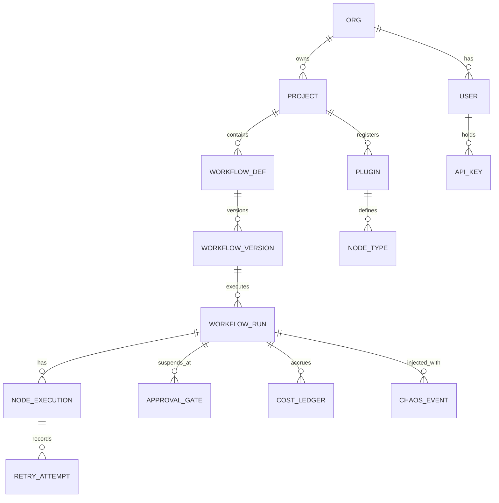

### 7.1 Core tables (selected DDL)

```sql
-- Workflow definitions & versions ------------------------------------------
CREATE TABLE workflow_def (
    id            UUID PRIMARY KEY DEFAULT gen_random_uuid(),
    project_id    UUID NOT NULL REFERENCES project(id),
    name          TEXT NOT NULL,
    created_at    TIMESTAMPTZ NOT NULL DEFAULT now(),
    UNIQUE (project_id, name)
);

CREATE TABLE workflow_version (
    id            UUID PRIMARY KEY DEFAULT gen_random_uuid(),
    workflow_def_id UUID NOT NULL REFERENCES workflow_def(id),
    version       INT  NOT NULL,                 -- monotonically increasing
    dag_spec      JSONB NOT NULL,                -- declarative DAG (nodes, edges, policies)
    code_hash     TEXT NOT NULL,                 -- content-address of workflow code
    determinism_token TEXT NOT NULL,             -- Temporal build/version ID for safe replay
    created_at    TIMESTAMPTZ NOT NULL DEFAULT now(),
    UNIQUE (workflow_def_id, version)
);

-- Runs (a projection over Temporal history for fast querying) ---------------
CREATE TABLE workflow_run (
    id              UUID PRIMARY KEY DEFAULT gen_random_uuid(),
    temporal_wf_id  TEXT NOT NULL,               -- Temporal WorkflowId
    temporal_run_id TEXT NOT NULL,               -- Temporal RunId (changes on continue-as-new)
    workflow_version_id UUID NOT NULL REFERENCES workflow_version(id),
    status          TEXT NOT NULL,               -- see state machine §11
    input_ref       TEXT,                        -- object-store pointer if large
    output_ref      TEXT,
    started_at      TIMESTAMPTZ,
    closed_at       TIMESTAMPTZ,
    UNIQUE (temporal_wf_id, temporal_run_id)
);
CREATE INDEX ix_run_status ON workflow_run(status);
CREATE INDEX ix_run_version ON workflow_run(workflow_version_id);

-- Per-node execution projection --------------------------------------------
CREATE TABLE node_execution (
    id            UUID PRIMARY KEY DEFAULT gen_random_uuid(),
    run_id        UUID NOT NULL REFERENCES workflow_run(id),
    node_id       TEXT NOT NULL,                 -- stable node id within DAG
    node_type     TEXT NOT NULL,                 -- llm / embedding / http / ...
    status        TEXT NOT NULL,                 -- pending/running/completed/failed/retrying/waiting
    idempotency_key TEXT NOT NULL,
    ray_object_ref  TEXT,
    input_ref     TEXT,
    output_ref    TEXT,
    started_at    TIMESTAMPTZ,
    ended_at      TIMESTAMPTZ,
    duration_ms   INT,
    UNIQUE (run_id, node_id)
);

CREATE TABLE retry_attempt (
    id            UUID PRIMARY KEY DEFAULT gen_random_uuid(),
    node_execution_id UUID NOT NULL REFERENCES node_execution(id),
    attempt       INT NOT NULL,
    error_type    TEXT,                          -- timeout/rate_limit/oom/provider_5xx/...
    error_detail  TEXT,
    backoff_ms    INT,
    occurred_at   TIMESTAMPTZ NOT NULL DEFAULT now()
);

-- Human-in-the-loop gates ---------------------------------------------------
CREATE TABLE approval_gate (
    id            UUID PRIMARY KEY DEFAULT gen_random_uuid(),
    run_id        UUID NOT NULL REFERENCES workflow_run(id),
    node_id       TEXT NOT NULL,
    status        TEXT NOT NULL DEFAULT 'waiting',  -- waiting/approved/rejected/expired
    payload       JSONB,                            -- what the human reviews
    decided_by    UUID REFERENCES "user"(id),
    decided_at    TIMESTAMPTZ,
    expires_at    TIMESTAMPTZ,
    created_at    TIMESTAMPTZ NOT NULL DEFAULT now()
);

-- Cost/token accounting -----------------------------------------------------
CREATE TABLE cost_ledger (
    id            UUID PRIMARY KEY DEFAULT gen_random_uuid(),
    run_id        UUID NOT NULL REFERENCES workflow_run(id),
    node_id       TEXT NOT NULL,
    provider      TEXT,                          -- openai/anthropic/local/...
    model         TEXT,
    input_tokens  INT,
    output_tokens INT,
    usd_cost      NUMERIC(12,6),
    occurred_at   TIMESTAMPTZ NOT NULL DEFAULT now()
);

-- Plugins / node types ------------------------------------------------------
CREATE TABLE plugin (
    id            UUID PRIMARY KEY DEFAULT gen_random_uuid(),
    project_id    UUID NOT NULL REFERENCES project(id),
    name          TEXT NOT NULL,
    version       TEXT NOT NULL,
    entrypoint    TEXT NOT NULL,                 -- import path
    schema        JSONB NOT NULL,                -- input/output JSON schema
    sandbox_policy JSONB NOT NULL,               -- resources, network, capabilities
    signature     TEXT,                          -- supply-chain signing
    UNIQUE (project_id, name, version)
);

-- Chaos experiments ---------------------------------------------------------
CREATE TABLE chaos_event (
    id            UUID PRIMARY KEY DEFAULT gen_random_uuid(),
    run_id        UUID REFERENCES workflow_run(id),
    fault_type    TEXT NOT NULL,                 -- kill_worker/drop_api/timeout/gpu_oom/...
    target        TEXT,
    injected_at   TIMESTAMPTZ NOT NULL DEFAULT now(),
    recovered_at  TIMESTAMPTZ,
    recovery_ms   INT
);
```

**Design note — projection, not source of truth:** `workflow_run` and `node_execution` are *read-optimized projections* rebuilt from Temporal history by an event-consumer. Temporal's history is authoritative; if Postgres projections are lost we can rebuild them. This keeps the durability guarantee anchored in one place and makes the app DB replaceable.

---

## 8. Event Flow

Everything is event-sourced. Temporal produces a canonical event history; Ancora consumes it to drive projections, the live UI, metrics, and the cost ledger.

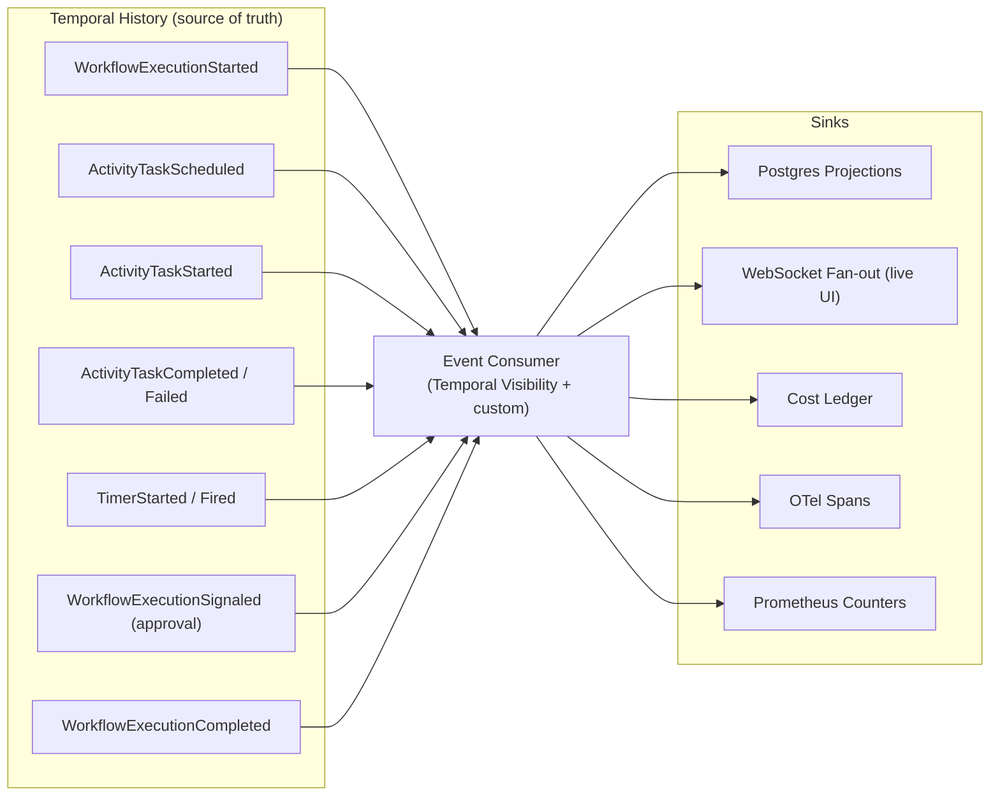

**Live update path:** activity workers emit heartbeats and progress via Temporal activity heartbeats *and* a Redis pub/sub channel keyed by `run_id`. The API Gateway subscribes and pushes to connected dashboard clients over WebSocket, so the DAG animates in real time without polling Temporal on the hot path.

---

## 9. Workflow Lifecycle

```mermaid
sequenceDiagram
    autonumber
    participant Dev
    participant API as API Gateway
    participant WFSVC as Workflow Service
    participant T as Temporal
    participant WW as Workflow Worker
    participant AW as Activity Worker
    participant Ray

    Dev->>API: POST /workflows/{name}/runs (input)
    API->>WFSVC: validate + authz
    WFSVC->>T: StartWorkflowExecution(id, version, input)
    T-->>WFSVC: run_id
    WFSVC-->>API: 202 Accepted {run_id}
    T->>WW: Deliver workflow task
    WW->>WW: Deterministically evaluate DAG → next nodes
    WW->>T: Command: ScheduleActivity(node_A)
    T->>AW: Activity task (node_A)
    AW->>Ray: dispatch compute (idempotency_key)
    Ray-->>AW: result
    AW->>T: CompleteActivity(result)
    T->>WW: Deliver result (append to history)
    WW->>WW: Evaluate branches; fan-out node_B, node_C in parallel
    Note over WW,Ray: repeat until terminal
    WW->>T: CompleteWorkflow(output)
    T-->>API: (via query/webhook) status=Completed
```

**Key properties enforced across the lifecycle:**
- **Determinism:** workflow code only orchestrates; all effects go through activities.
- **Checkpointing is implicit:** every completed activity is a durable checkpoint in history — no explicit save/load.
- **Resume is free:** if any worker dies, Temporal re-delivers the workflow task to another worker, which replays history to reconstruct exact state, then continues.

---

## 10. Failure Recovery Lifecycle

This is the product's core value. Recovery is handled at two layers with different guarantees.

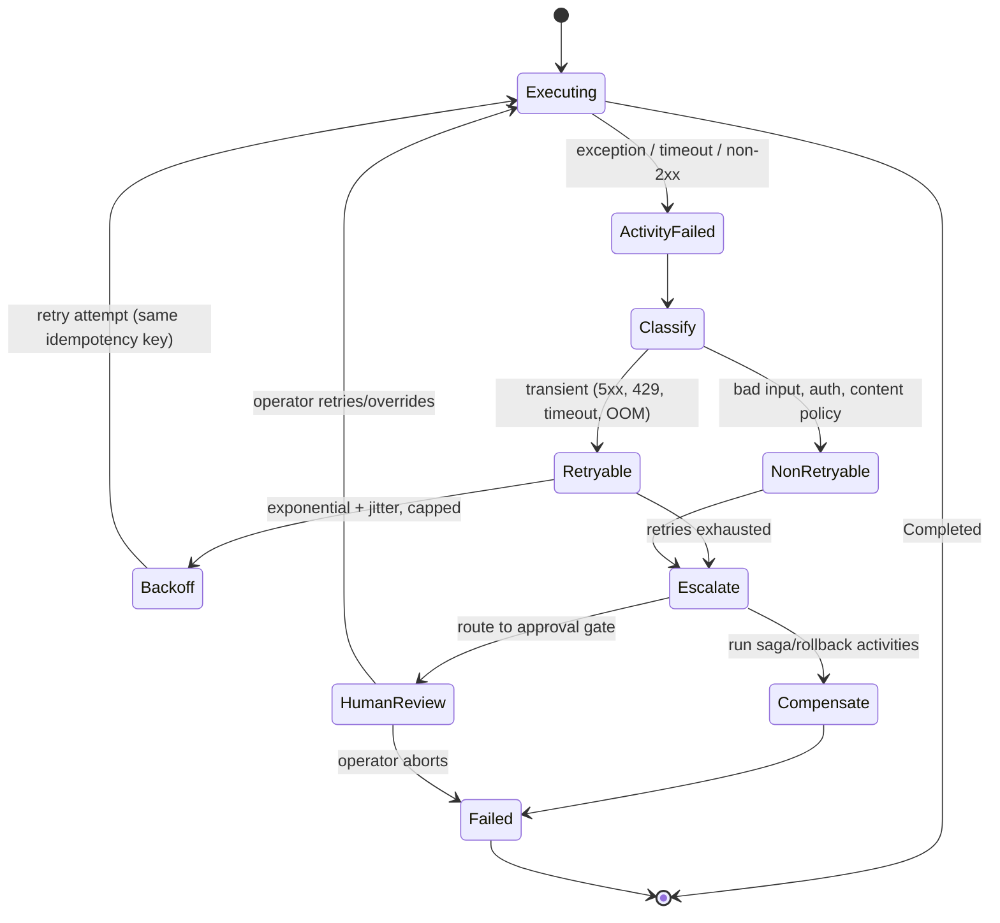

### 10.1 Recovery matrix — how each demo failure is handled

| Injected failure | Detected by | Automatic response | Idempotency safeguard |
|---|---|---|---|
| **Worker crash** (activity worker dies mid-task) | Missed heartbeat / task timeout | Temporal re-queues task to another worker; Ray result may be re-fetched by `ObjectRef` or recomputed | Idempotency key + result cache dedupes side effects |
| **API timeout** | Activity `start_to_close_timeout` | Retry policy fires with backoff | Cached partial results keyed by attempt |
| **LLM failure** (5xx / malformed) | Exception classification | Retry; optional model fallback chain (primary → secondary) | Deterministic prompt hash key |
| **Network interruption** | gRPC/HTTP error | Retry; workflow state untouched (in history) | N/A — no side effect committed yet |
| **GPU OOM** | Ray `OutOfMemoryError` / OOM-kill | Ray reschedules on a larger-memory node; autoscaler may add capacity; optional batch-size downshift | Recompute is safe (pure activity) |
| **Rate limit (429)** | Provider header / status | Redis token-bucket throttle + `retry-after` aware backoff | Global limiter prevents retry storm |
| **Process restart / deploy** | Worker disconnect | All in-flight workflows replay on new workers | Full — durability core |
| **Database restart** | Temporal persistence blip | Temporal buffers & retries internally; workflows pause, then resume | Full |

**Guarantee statement:** For **pure** activities (no external side effect), Ancora provides *effectively exactly-once* completion via at-least-once execution + result caching. For **side-effecting** activities (send email, charge card), Ancora provides *exactly-once via idempotency keys* that the developer must supply or the SDK derives deterministically — the runtime enforces the check but the developer owns the key's semantic meaning.

---

## 11. State Machine

### 11.1 Workflow run states

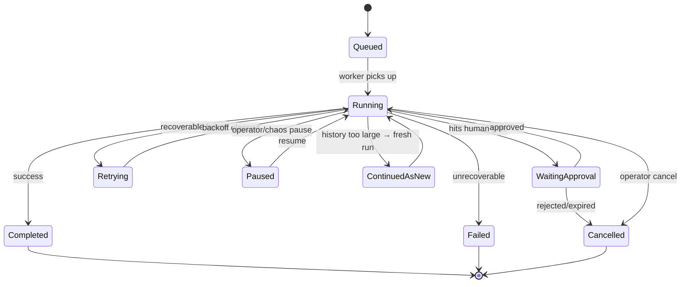

### 11.2 Node execution states

`Pending → Running → (Completed | Failed | Retrying | WaitingApproval)`; `Retrying → Running` on backoff; `WaitingApproval → Running` on signal. These map 1:1 to the UI node badges (§15).

**Note on `ContinuedAsNew`:** long-running or high-cardinality workflows accumulate large histories, which slow replay. Temporal's continue-as-new atomically starts a fresh execution carrying forward summarized state. Ancora surfaces this transparently — the logical run appears continuous in the UI even though `run_id` changes underneath.

---

## 12. API Design

REST for control operations; WebSocket for live streams. Versioned under `/v1`. All mutating endpoints require an idempotency key header. OpenAPI spec is generated from FastAPI/Pydantic models.

### 12.1 Core REST surface

```http
# Workflow definitions
POST   /v1/workflows                      # register/version a workflow definition
GET    /v1/workflows                      # list definitions
GET    /v1/workflows/{name}               # get definition + versions

# Runs
POST   /v1/workflows/{name}/runs          # start a run  → 202 {run_id}
GET    /v1/runs/{run_id}                  # run status + summary
GET    /v1/runs/{run_id}/nodes            # per-node execution projection
GET    /v1/runs/{run_id}/history          # full event history (replayable)
POST   /v1/runs/{run_id}/signals/{name}   # send signal (e.g. approval)
POST   /v1/runs/{run_id}/cancel           # graceful cancel
POST   /v1/runs/{run_id}/terminate        # hard terminate
POST   /v1/runs/{run_id}/replay           # deterministic replay (debug)

# Human-in-the-loop
GET    /v1/approvals?status=waiting       # pending gates
POST   /v1/approvals/{gate_id}/decision   # {approve|reject, comment}

# Observability
GET    /v1/runs/{run_id}/cost             # token/$ ledger
GET    /v1/workers                        # worker health, pools, utilization
GET    /v1/queues                         # task-queue depths

# Chaos
POST   /v1/chaos/inject                   # {fault_type, target, run_id?}
GET    /v1/chaos/experiments              # fault→recovery timelines

# Plugins
POST   /v1/plugins                        # register custom node type
GET    /v1/plugins                        # list node types + schemas
```

### 12.2 WebSocket / SSE channels

```
WS  /v1/stream/runs/{run_id}     → node state transitions, logs, progress, cost deltas
WS  /v1/stream/workers           → worker health, GPU/CPU/mem, queue depth
WS  /v1/stream/events            → org-wide event firehose (filterable)
```

### 12.3 Representative request/response

```jsonc
// POST /v1/workflows/research_agent/runs
// Headers: Authorization: Bearer …, Idempotency-Key: 7f3c…
{
  "input": { "topic": "durable execution for AI", "max_sources": 5 },
  "version": 3,                     // omit → latest
  "options": { "priority": "high", "budget_usd": 2.00 }
}
// → 202 Accepted
{
  "run_id": "run_01J…",
  "temporal_wf_id": "research_agent-01J…",
  "status": "Queued",
  "links": { "self": "/v1/runs/run_01J…", "stream": "/v1/stream/runs/run_01J…" }
}
```

---

## 13. SDK Design

Two authoring styles, one runtime. Both compile to the same durable Temporal workflow.

### 13.1 Imperative (Temporal-native, maximal control)

```python
from ancora import workflow, activity, RetryPolicy
from ancora.nodes import LLMNode, HTTPNode, ApprovalGate

@workflow
class ResearchAgent:
    @workflow.run
    async def run(self, topic: str) -> dict:
        # Each `call` is a durable activity dispatched to Ray.
        sources = await self.call(
            HTTPNode(url=f"https://search/?q={topic}"),
            retry=RetryPolicy(max_attempts=5, backoff="exponential"),
        )
        # Parallel fan-out — runs on distributed Ray workers.
        summaries = await self.gather(*[
            self.call(LLMNode(model="claude-opus-4-8", prompt=summarize(s)))
            for s in sources
        ])
        draft = await self.call(LLMNode(model="claude-opus-4-8", prompt=synthesize(summaries)))

        # Durable human gate — process holds ZERO resources while waiting.
        decision = await self.await_approval(
            ApprovalGate(payload=draft, expires_in="3d")
        )
        if not decision.approved:
            return {"status": "rejected"}
        return {"status": "published", "draft": draft}
```

### 13.2 Declarative DAG (portable, framework-target)

```python
from ancora import Graph, node

g = Graph("research_agent", version=3)
search = g.add(node.HTTP(id="search", url="https://search/?q={{topic}}"))
summ   = g.add(node.LLM(id="summarize", model="claude-opus-4-8"), map_over=search.output)
synth  = g.add(node.LLM(id="synthesize", model="claude-opus-4-8"), depends_on=[summ])
gate   = g.add(node.Approval(id="review", depends_on=[synth], expires_in="3d"))
g.edge(gate.on("approved") >> node.HTTP(id="publish", method="POST", url="https://cms"))
g.compile()   # → validated dag_spec JSON, registered via API
```

### 13.3 SDK design principles

- **Determinism guardrails:** the SDK ships a static analyzer + runtime sandbox that flags forbidden operations in workflow code (`datetime.now()`, `random`, direct network I/O) and points to the activity equivalent.
- **Typed I/O:** every node declares Pydantic input/output; mismatches fail at compile, not at 2am.
- **Local-first:** `ancora dev` runs an in-process Temporal + local Ray so the identical code runs on a laptop.
- **Idempotency by construction:** `self.call` derives a deterministic idempotency key from `(node_id, attempt-invariant input hash)`; side-effecting nodes can override.

---

## 14. Plugin Architecture

Nodes are the extension unit. A node is a typed, sandboxed, versioned unit of work that runs as a Ray task/actor and is invoked via a Temporal activity.

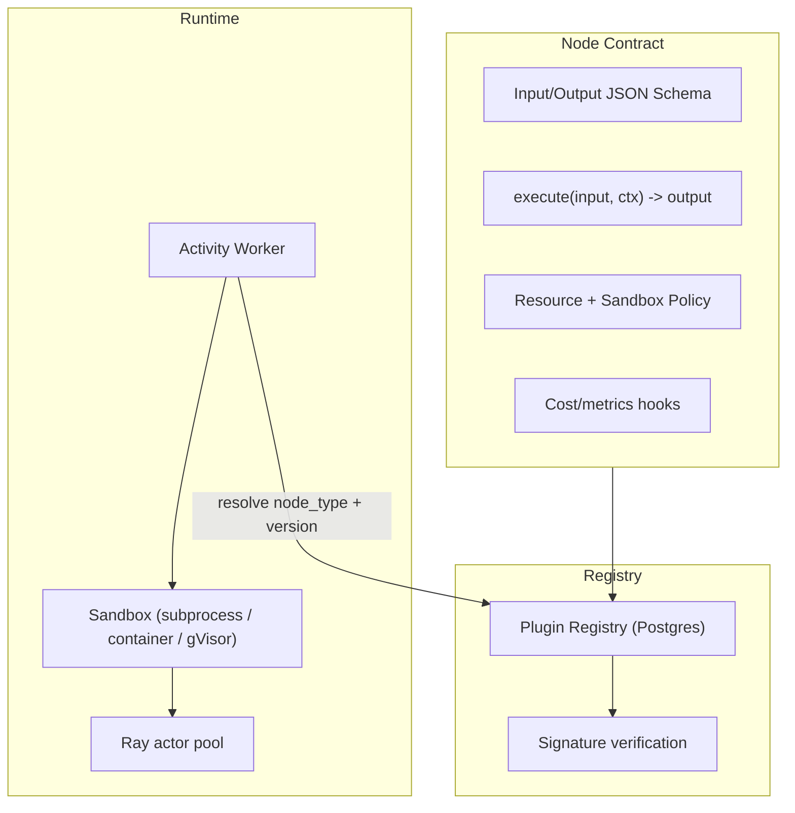

### 14.1 Built-in node library

| Node | Purpose | Runs on | Notes |
|---|---|---|---|
| **LLMNode** | Chat/completion with any provider | GPU (local) or CPU (API) | Streaming, fallback chains, token accounting |
| **EmbeddingNode** | Vectorize text | GPU/CPU batch | Auto-batching on Ray |
| **RetrievalNode** | Vector/keyword search | CPU | Pluggable backends (pgvector, external) |
| **ToolCallNode** | Execute a declared tool | CPU | Schema-validated args |
| **PythonNode** | Arbitrary Python fn | CPU/GPU | Sandboxed |
| **HTTPNode** | REST call | CPU | Idempotency, retry-after aware |
| **DatabaseNode** | Parameterized SQL | CPU | Connection pooling, read/write split |
| **WebhookNode** | Emit event | CPU | At-least-once with dedupe |
| **ShellNode** | Run command | Sandboxed CPU | gVisor/container isolation |
| **ApprovalGate** | Human-in-the-loop | none | Durable wait, no compute cost |
| **CustomComputeNode** | User-defined Ray actor | CPU/GPU | Full resource control |

### 14.2 Custom node example

```python
from ancora.plugin import node, NodeContext
from pydantic import BaseModel

class RerankIn(BaseModel):
    query: str
    docs: list[str]
class RerankOut(BaseModel):
    ranked: list[str]

@node(
    name="cross_encoder_rerank",
    version="1.0.0",
    resources={"num_gpus": 1, "memory_mb": 8000},
    sandbox={"network": "deny", "filesystem": "read_only"},
)
async def rerank(inp: RerankIn, ctx: NodeContext) -> RerankOut:
    model = ctx.ray_get_or_create_actor("cross-encoder")   # cached across calls
    scores = await model.score.remote(inp.query, inp.docs)
    ctx.record_cost(gpu_seconds=ctx.elapsed())              # cost hook
    return RerankOut(ranked=[d for _, d in sorted(zip(scores, inp.docs), reverse=True)])
```

**Isolation tiers:** trusted first-party (in-process), semi-trusted (subprocess with resource limits), untrusted (container/gVisor with network deny). The registry's `sandbox_policy` selects the tier; the activity worker enforces it before dispatch to Ray.

---

## 15. UI Wireframes

Design language: dense, dark-first, keyboard-navigable — Temporal Cloud × Vercel × Ray Dashboard × GitHub Actions. Next.js + TypeScript + Tailwind + shadcn/ui + React Flow + WebSockets.

### 15.1 Dashboard (home)

```
┌───────────────────────────────────────────────────────────────────────────┐
│ Ancora   Workflows  Workers  History  Chaos            [org ▾]  [⌘K]  ◐    │
├───────────────────────────────────────────────────────────────────────────┤
│  Running 42     Completed 1.2k    Failed 7     Waiting 3    $Today  $184.20 │
│ ┌──────────────┐ ┌──────────────┐ ┌──────────────┐ ┌──────────────────────┐ │
│ │ Queue depth  │ │ GPU util 78% │ │ Worker health│ │ p95 node latency     │ │
│ │  ▁▂▅▇▆▃  128  │ │  ███████░░   │ │  18/20 ●     │ │  ▂▃▂▅▃▂  2.4s        │ │
│ └──────────────┘ └──────────────┘ └──────────────┘ └──────────────────────┘ │
│  Recent runs                                                                │
│  ● research_agent   #01J…  Running   3/10 nodes   00:42   $0.87   [view]    │
│  ⏸ invoice_review   #01J…  Waiting   approval     2d      $0.12   [view]    │
│  ✖ batch_embed      #01J…  Failed    GPU OOM →recovered   $4.10   [view]    │
└───────────────────────────────────────────────────────────────────────────┘
```

### 15.2 Workflow view — interactive DAG (React Flow)

```
┌──────────────────────────────── run #01J…  research_agent v3 ─────────────┐
│  [Replay ▷]  [Pause ⏸]  [Cancel ✖]           status: Running   $0.87       │
│                                                                            │
│     ┌─────────┐      ┌──────────────┐        ┌───────────┐                 │
│     │ search  │─────▶│  summarize    │───┐   │ synthesize│                 │
│     │  ●done  │      │  ●running x3  │   ├──▶│  ○pending │                 │
│     └─────────┘      │  (fan-out)    │   │   └───────────┘                 │
│                      └──────────────┘   │        │                        │
│                                          │        ▼                        │
│                                    ┌───────────┐  ┌───────────┐            │
│                                    │  review   │  │  publish  │            │
│                                    │ ⏸waiting  │  │  ○pending │            │
│                                    └───────────┘  └───────────┘            │
│  Legend: ●done ◍running ○pending ⟳retrying ⏸waiting ✖failed                │
├─────────────────────────── node inspector: summarize[1] ──────────────────┤
│  Status running · Worker gpu-07 · Attempt 1 · 1.9s · $0.03 · 812 tok       │
│  Input ▸ {"text":"…"}    Output ▸ (streaming…)    Retries ▸ none           │
│  Logs ▸  12:04:01 dispatch→ray  12:04:02 model=claude-opus-4-8 …           │
└────────────────────────────────────────────────────────────────────────────┘
```

### 15.3 Worker view

```
┌─────────────────────────────── Workers ──────────────────────────────────┐
│  Pool: GPU (12)   CPU (8)   Autoscaler: ● enabled   target 82% util       │
│  ┌ gpu-07 ─────────────┐ ┌ gpu-08 ─────────────┐ ┌ cpu-03 ──────────────┐ │
│  │ ● healthy           │ │ ● healthy           │ │ ● healthy            │ │
│  │ GPU ███████░ 74%    │ │ GPU █████░░░ 51%     │ │ CPU ███░░ 38%        │ │
│  │ MEM ██████░ 22/32GB │ │ MEM ████░░ 14/32GB   │ │ tasks 4 · idle       │ │
│  │ tasks: summarize×3  │ │ tasks: embed×8       │ │                      │ │
│  └─────────────────────┘ └─────────────────────┘ └──────────────────────┘ │
└────────────────────────────────────────────────────────────────────────────┘
```

### 15.4 Workflow history / replay

```
┌───────────────────────── History — run #01J… ────────────────────────────┐
│  ◀ ▏▎▍▌▋▊▉█  ▶   [scrub timeline]         [Replay from selected ⟲]         │
│  t+0.0s  WorkflowStarted           input {topic:"…"}                       │
│  t+0.3s  ActivityScheduled         search                                  │
│  t+1.1s  ActivityCompleted         search → 5 sources                      │
│  t+1.2s  ActivityScheduled ×3      summarize (fan-out)                     │
│  t+3.0s  ActivityFailed            summarize[2] rate_limit(429) → retry    │
│  t+4.4s  ActivityCompleted ×3      summarize                               │
│  t+4.5s  TimerStarted              approval expires in 3d                  │
│  …       WorkflowSignaled          approval=approved by alice              │
└────────────────────────────────────────────────────────────────────────────┘
```

### 15.5 Chaos mode

```
┌──────────────────────────────── Chaos Lab ───────────────────────────────┐
│  Inject fault into: [ run #01J… ▾ ]                                        │
│  ┌ Kill worker ┐ ┌ Drop API ┐ ┌ Network timeout ┐ ┌ GPU crash ┐ ┌ DB blip┐│
│  │  [inject]   │ │ [inject] │ │    [inject]      │ │ [inject]  │ │[inject]││
│  └─────────────┘ └──────────┘ └──────────────────┘ └───────────┘ └────────┘│
│  Live recovery timeline                                                    │
│  12:10:00  💥 killed gpu-07 (running summarize×3)                          │
│  12:10:01  ⟳ Temporal re-queued 3 activities                              │
│  12:10:03  ➕ autoscaler added gpu-09                                      │
│  12:10:06  ✅ all activities completed on gpu-08/gpu-09 — recovery 6.0s    │
│  Result: 0 lost state · 0 duplicated side effects · workflow on track      │
└────────────────────────────────────────────────────────────────────────────┘
```

---

## 16. Folder Structure

```
ancora/
├── docs/
│   └── RFC-0001-durable-ai-runtime.md
├── packages/
│   ├── sdk-python/                 # ancora SDK (workflow/activity/nodes)
│   │   └── ancora/
│   │       ├── workflow.py
│   │       ├── activity.py
│   │       ├── nodes/              # built-in node library
│   │       ├── plugin/             # plugin contract + registry client
│   │       └── determinism.py      # static analyzer + guardrails
│   └── cli/                        # `ancora` CLI (dev, deploy, run, logs)
├── services/
│   ├── api-gateway/                # FastAPI: REST + WS
│   ├── workflow-service/           # Temporal client orchestration
│   ├── activity-workers/           # Temporal ↔ Ray bridge
│   ├── workflow-workers/           # deterministic workflow execution
│   ├── event-consumer/             # history → projections/metrics/cost
│   ├── plugin-registry/            # node catalog + sandbox policy
│   └── chaos-controller/           # fault injection
├── web/                            # Next.js dashboard
│   ├── app/                        # routes: dashboard, workflow, workers, history, chaos
│   ├── components/                 # shadcn/ui + React Flow DAG
│   └── lib/ws/                     # WebSocket client
├── deploy/
│   ├── docker/                     # Dockerfiles + docker-compose.yml (single-node)
│   ├── helm/                       # Kubernetes charts
│   └── terraform/                  # cloud infra (v2)
├── migrations/                     # Postgres schema (app DB)
├── observability/
│   ├── otel-collector-config.yaml
│   ├── prometheus/
│   └── grafana/dashboards/
├── examples/                       # sample workflows (research agent, batch eval, …)
└── tests/
    ├── unit/
    ├── integration/                # Temporal + Ray in-loop
    └── chaos/                      # automated failure-injection suite
```

---

## 17. Deployment Architecture

Three deployment tiers, identical code:

```mermaid
flowchart LR
    subgraph Dev["1 · Local dev (`ancora dev`)"]
        D1["In-process Temporal (dev server)"]
        D2["Local Ray (local_mode)"]
        D3["SQLite/embedded PG"]
    end
    subgraph Compose["2 · Single node (Docker Compose)"]
        C1["Temporal + Postgres"]
        C2["Ray head+worker"]
        C3["API + Web + Prom/Grafana"]
    end
    subgraph K8s["3 · Production (Kubernetes + Helm)"]
        K1["Temporal cluster (HA)"]
        K2["KubeRay operator + autoscaled pools"]
        K3["HPA/KEDA on all stateless tiers"]
        K4["Postgres HA + Redis + object store"]
    end
    Dev --> Compose --> K8s
```

- **Local dev:** single command, no external deps, sub-second start — critical for adoption.
- **Docker Compose:** the "clone and `docker compose up`" experience; full stack on one machine for demos and small workloads.
- **Kubernetes:** Helm chart wires Temporal (Helm or Temporal Cloud), KubeRay operator for autoscaled GPU/CPU pools, KEDA for queue-driven activity-worker scaling, and the observability stack. Cloud-native, 12-factor, horizontally scalable.

---

## 18. Scaling Strategy

| Dimension | Bottleneck | Strategy |
|---|---|---|
| **Workflow throughput** | Temporal history service | Shard by workflow ID (native); scale history/matching; multiple task queues |
| **Activity throughput** | Activity worker count | KEDA autoscale on task-queue depth; separate queues per node class (GPU vs CPU) |
| **Compute** | Ray cluster capacity | Ray autoscaler adds/removes nodes on pending-task pressure; distinct GPU/CPU pools; placement groups for locality |
| **Large payloads** | Temporal blob size limits | Offload to object store; pass references, not bytes, through history |
| **Hot workflows** | Single-workflow serialization (Temporal is single-writer per workflow) | Fan work out to child workflows / activities; `continue-as-new` to bound history |
| **Read/query load** | Postgres projections | Read replicas; partition `node_execution` by time; cache hot runs in Redis |
| **Live UI fan-out** | WebSocket connections | Redis pub/sub + horizontally scaled gateway; per-run channels |
| **Rate-limited providers** | External API quotas | Global Redis token buckets per provider/model; queue + backpressure |

**Principle:** the durability core scales by *sharding* (Temporal), the compute core scales by *elasticity* (Ray autoscaler), and the stateless tiers scale by *replication* (HPA/KEDA). No single component is a monolithic bottleneck.

---

## 19. Security Model

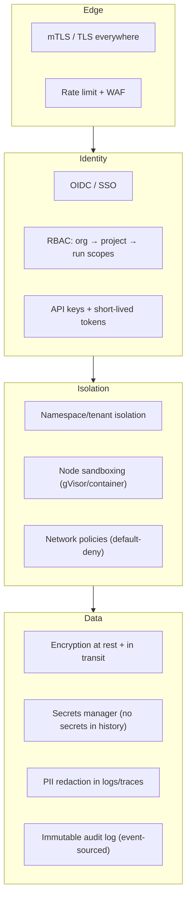

Key controls:
- **Tenant isolation** via Temporal namespaces + per-project task queues + Ray runtime-env boundaries.
- **Untrusted node execution** runs in gVisor/container sandboxes with default-deny networking and declared resource ceilings; the shell node is *always* sandboxed.
- **Secrets never enter workflow history** — activities fetch from a secrets manager at execution time; history stores references only. This matters because history is durable and replayable, so a leaked secret would be leaked forever.
- **Auditability is free**: the event-sourced history *is* a tamper-evident audit log. Every state change, approval, and retry is recorded with actor and timestamp.
- **Supply chain:** plugins are signature-verified before registration; SBOM + provenance for images.

---

## 20. Future Roadmap

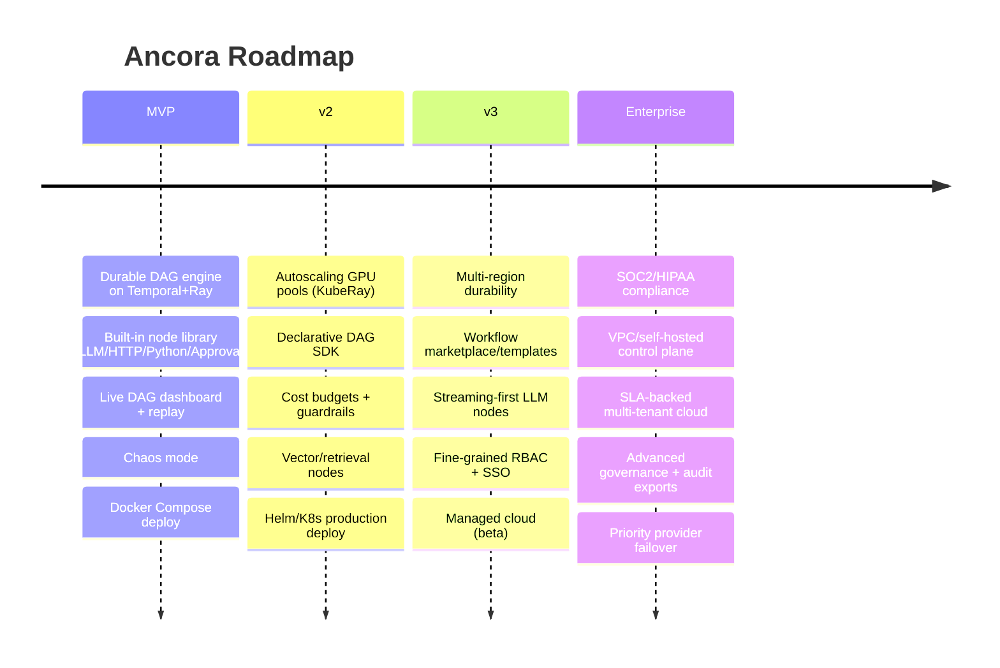

### MVP (0 → 1)
- Durable DAG execution (branches, parallel, retries, checkpoint, resume) on Temporal.
- Ray bridge for compute; single GPU/CPU pool.
- Built-in nodes: LLM, HTTP, Python, Database, Approval.
- Dashboard: dashboard, workflow DAG, worker view, history/replay, chaos mode.
- Deterministic replay + idempotency enforcement.
- Docker Compose + `ancora dev`.
- OTel + Prometheus + Grafana.

### v2
- KubeRay autoscaling GPU pools; distinct queues per node class.
- Declarative DAG SDK + framework-target compilers (LangGraph adapter).
- Cost budgets, per-run/$ ceilings, provider fallback chains.
- Retrieval/embedding nodes with auto-batching.
- Production Helm chart; KEDA-driven activity scaling.

### v3
- Multi-region / DR durability.
- Workflow template marketplace.
- Streaming-first LLM UX end-to-end.
- SSO, fine-grained RBAC, org governance.
- Managed cloud beta.

### Enterprise
- SOC2 Type II, HIPAA, ISO 27001.
- Self-hosted control plane / BYOC.
- SLA-backed multi-tenant cloud, dedicated capacity.
- Audit exports, DLP, governance policies.

---

## 21. Engineering Tradeoffs

Every major decision and *why*:

| Decision | Chosen | Rejected alternative | Why |
|---|---|---|---|
| **Durability engine** | Build on **Temporal** | Roll our own event-sourced engine | Temporal has a decade of hardening on the exact problem (deterministic replay, history, timers, signals). Reimplementing it is a multi-year distraction from our actual value: the AI/compute fusion. |
| **Compute engine** | Build on **Ray** | Kubernetes Jobs / Celery / custom | Ray uniquely offers Python-native distributed compute *with* GPU scheduling, actors, and object store. Celery lacks GPU/actor model; raw K8s Jobs lack fine-grained scheduling and shared object memory. |
| **Bridge model** | Temporal **activity → Ray task** | Run Ray *inside* workflow code | Workflow code must be deterministic; Ray calls are non-deterministic I/O. The activity boundary is the only correct seam. Violating it corrupts replay. |
| **State source of truth** | Temporal **history**; Postgres = projection | Postgres as primary state | One durability guarantee, one place. Projections are rebuildable and swappable; two sources of truth invite split-brain. |
| **Idempotency** | Developer-supplied/derived keys, runtime-enforced | Fully automatic exactly-once | True exactly-once for arbitrary external side effects is impossible; we give exactly-once for pure work and *enforced* idempotency keys for effects. Honest guarantee > magic that silently double-charges. |
| **Not an agent framework** | Runtime only | Ship agent ergonomics too | Owning the runtime layer is a durable moat and keeps us un-opinionated so frameworks target us. Bundling agent DSLs would make us a LangChain competitor and shrink the market. |
| **Language** | Python backend | Go/Rust for perf | Our users, the AI ecosystem, and Ray are Python. Determinism-critical hot paths live in Temporal (Go) already; our glue doesn't need to be. |
| **Large payloads** | Object-store references | Inline in history | Temporal history has size limits and replay cost scales with history size; big blobs would bloat and slow every replay. |
| **UI transport** | WebSocket + Redis pub/sub | Poll Temporal | Polling the durability core for live UI would add load to the critical path; a projection + pub/sub decouples read scaling from durability. |
| **Human-in-loop** | Durable Temporal timers/signals | Hold a thread/DB row + poller | A durable workflow can wait days at zero compute cost and survive restarts — a held thread or cron-poller cannot. |

---

## 22. Risks

| Risk | Likelihood | Impact | Mitigation |
|---|---|---|---|
| **Operational complexity** — running Temporal *and* Ray *and* the app is a lot of moving parts | High | High | `ancora dev` + Compose hide it in dev; Helm + managed options in prod; strong defaults; eventually a managed cloud |
| **Determinism footguns** — users write non-deterministic workflow code and corrupt replay | High | High | Static analyzer, runtime sandbox, clear errors, extensive docs, examples that model correct patterns |
| **Two-system version skew** — Temporal and Ray upgrade independently and break the bridge | Medium | Medium | Pin + integration-test the matrix; abstraction layer at the bridge; CI against version combos |
| **Latency overhead** — activity round-trips add ms vs. a raw in-process loop | Medium | Medium | Batch/fan-out on Ray; local caching; the durability win dwarfs the overhead for the target workloads |
| **Ray head SPOF** | Medium | High | GCS fault tolerance + Redis-backed HA; graceful degradation; workflows survive via Temporal even if Ray blips |
| **Adoption** — "why not just Temporal or just Ray?" | Medium | High | Lead with the demo: kill a worker mid-agent, watch it recover. The chaos UX *is* the pitch |
| **Cost of GPUs in demos/CI** | Medium | Low | CPU-only default nodes; GPU tests gated; mock LLM provider for CI |
| **Scope creep toward agent framework** | Medium | Medium | Charter discipline: we ship the runtime, not the agent DSL |

---

## 23. Open Questions

1. **Determinism enforcement strength** — how aggressive should the static analyzer be? Hard-fail on any suspicious call, or warn-and-sandbox? Too strict frustrates; too lax corrupts state.
2. **Ray-inside vs. Ray-adjacent** — should activity workers *be* Ray actors (co-located) or external clients dispatching to Ray? Co-location cuts a hop but couples lifecycles.
3. **Result caching semantics** — where does the pure-activity result cache live (Ray object store vs. Redis vs. object store), and what is its TTL/eviction policy under replay?
4. **Multi-tenancy depth** — namespace-level isolation for MVP vs. full per-tenant Ray clusters? Cost vs. isolation tradeoff.
5. **Workflow versioning UX** — how do we present Temporal's `patched`/build-ID versioning to users authoring in a DAG DSL without leaking Temporal internals?
6. **Streaming through durable boundaries** — LLM token streams are inherently non-durable; how much of a stream do we persist vs. treat as ephemeral UI-only?
7. **Cost attribution accuracy** — provider token counts vs. our estimates; how do we reconcile, and who's authoritative for budget enforcement?
8. **Backpressure policy** — when Ray is saturated and Temporal keeps scheduling activities, what's the queuing/rejection/priority model?

---

## 24. Stretch Goals

- **Time-travel debugger** — step through a workflow's history in the UI, inspect state at any event, and *fork* a replay from any point with modified inputs.
- **Speculative execution** — pre-warm likely branches (e.g. both sides of a conditional) on idle GPU capacity, discard the loser; trade cost for latency.
- **Workflow-as-a-tool** — expose any durable workflow as a callable tool to an LLM, so agents can invoke durable sub-workflows.
- **Cross-workflow memory** — durable, queryable long-term memory store as a first-class node backed by the object store + vector index.
- **Auto-compensation synthesis** — infer saga/rollback steps from node declarations so failure compensation is generated, not hand-written.
- **Deterministic LLM replay** — record provider responses in history so a replay reproduces the *exact* model outputs for debugging non-deterministic agents.
- **Budget-aware scheduler** — the scheduler treats `$` and `GPU-seconds` as first-class constraints, degrading model quality to stay within budget.
- **Multi-language SDKs** — TypeScript and Go SDKs targeting the same runtime, so non-Python teams can author workflows.
- **Federated / edge execution** — run compute nodes on edge/on-prem workers while durability stays in the cloud control plane.

---

*End of RFC-0001. This document is intended to guide implementation of a production-grade, open-source durable AI workflow runtime. Sections are versioned independently; propose changes via follow-up RFCs (RFC-0002+).*
