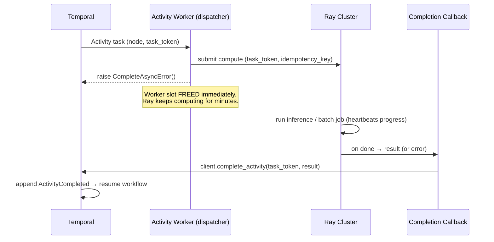
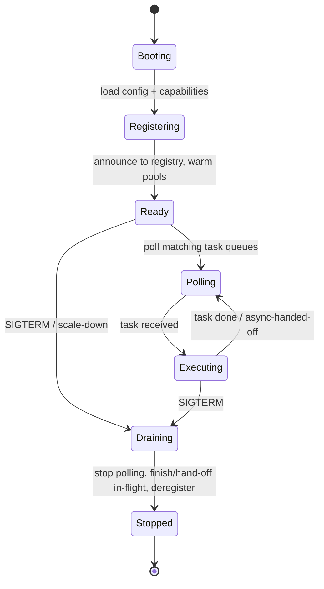
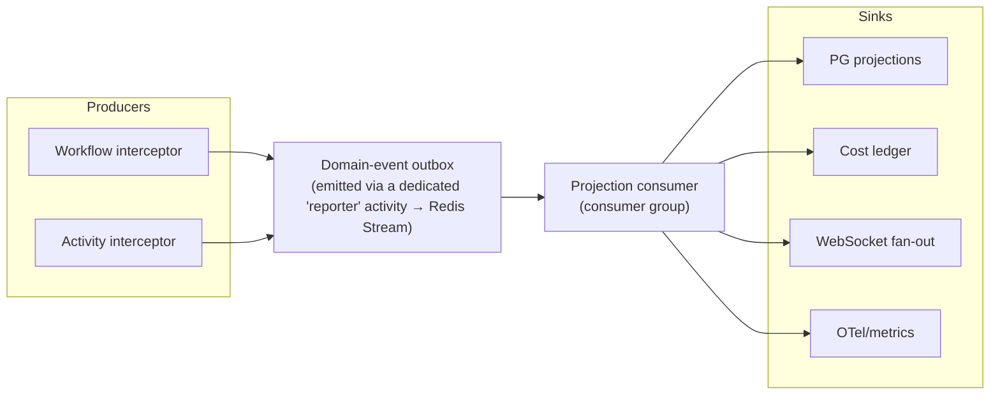
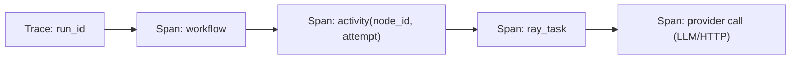

# RFC-0001a — Architecture Review & Amendments to RFC-0001

> **Status:** Review · **Author:** Principal Eng (final pre-implementation review) · **Supersedes:** nothing — *amends* RFC-0001
> **Purpose:** Challenge every load-bearing decision in RFC-0001, correct the weak ones, fill the gaps (scheduler, runtime, state, observability, plugins, UI, chaos), and lock scope before code is written.
> **Reading order:** RFC-0001 first, then this. Where the two disagree, **this document wins.**

---

## 0. Verdict up front

RFC-0001 is directionally correct and the positioning is defensible. Three decisions are **wrong or under-specified** and would cause real pain in production if implemented as written:

1. **The activity→Ray bridge blocks a Temporal activity slot for the entire Ray computation.** For minute-scale GPU inference this wastes worker slots and couples Ray duration to activity-worker capacity. **Fix: async activity completion** (§3.1).
2. **"Rebuild projections by tailing Temporal history" is not a real ingestion mechanism.** Temporal does not expose a global event firehose you can cheaply tail. **Fix: interceptor-based outbox** (§4.2).
3. **The "result cache" for idempotency is over-scoped.** Temporal already never re-runs a completed activity within a run; the only real dedup need is *side-effecting* activities across retries. **Fix: inbox/outbox idempotency table, delete the general cache** (§3.6, §5.2).

Two things should be **cut from MVP** as scope creep dressed up as architecture: the bespoke determinism static analyzer (use Temporal's workflow sandbox + mandatory replay tests instead — §1.5) and speculative execution / multi-language SDKs / marketplace (Future — §10).

Everything else is refinement. Details below.

---

## 1. Architecture Review — challenging every decision

### 1.1 Build on Temporal — **CONFIRMED, with one correction**

Correct call. Reimplementing event-sourced durable execution is a multi-year sink. The correction is philosophical and has teeth: RFC-0001 §7 says "Temporal history is the source of truth, Postgres is a projection" but then designs `approval_gate`, `node_execution`, and `cost_ledger` as if they were authoritative. They are not. **Rule to enforce everywhere:** if losing Postgres entirely must not change *what the workflow does next*, then Postgres holds no execution state. Approval decisions are Temporal **signals**; `approval_gate` is only a *pending-review index* for the UI. Cost enforcement happens *inside the workflow* from activity return values, not from the ledger. (Full ownership map in §4.)

> Would Temporal engineers agree? Yes — this is idiomatic Temporal. The anti-pattern they'd flag is treating an external DB as workflow state; we explicitly forbid it.

### 1.2 Build on Ray — **CONFIRMED, but treat Ray as cattle, not a pet**

Ray is the right compute engine (Python-native, GPU scheduling, actors, object store). RFC-0001's mitigation for the Ray-head SPOF ("GCS fault tolerance + Redis") is **too optimistic**. GCS fault tolerance reduces but does not eliminate head-node disruption, and a single global Ray cluster is a correlated-failure domain for *all* compute.

**Amendment:** Ray clusters are **ephemeral, replaceable, and hold zero durable state.** Consequences:
- Durability *never* depends on Ray surviving. If a Ray cluster dies, in-flight activities fail, Temporal retries them, and they land on a healthy cluster. The workflow does not notice beyond a retry.
- Run **multiple Ray clusters** partitioned by node-class and/or tenant (e.g. `ray-gpu`, `ray-cpu`), fronted by the activity layer. Losing one class does not halt the other. (MVP: single cluster is acceptable; the *architecture* must not assume one.)
- Nothing that must survive is stored in the Ray object store beyond the lifetime of a single activity attempt.

> Would Ray engineers agree? Yes — "keep durable state out of Ray, make clusters replaceable" is exactly how Ray is run in production at scale.

### 1.3 The bridge shape (activity → Ray task) — **CONFIRMED as the seam, REDESIGNED as the mechanism**

The *boundary* is right: workflow code is deterministic, all non-determinism lives in activities, activities dispatch to Ray. But the *mechanism* in RFC-0001 §5.2 (activity worker calls `ray.remote(...).remote()` and awaits the result inline) is the weak part. See §3.1 — this is the single most important redesign in this review.

### 1.4 State source of truth — **CONFIRMED, tightened** (see §4)

### 1.5 Determinism enforcement — **DESCOPED**

RFC-0001 §13.3 proposes a bespoke static analyzer that flags `datetime.now()`, `random`, network I/O in workflow code. Building and maintaining a correct Python static analyzer for this is a project unto itself and will be both over- and under-inclusive.

**Amendment — use what Temporal already ships:**
- The **Temporal Python workflow sandbox** already reimports modules per workflow task and restricts non-deterministic stdlib access at runtime. Lean on it.
- **Mandatory replay tests in CI**: every workflow ships with a recorded history; CI replays it against current code and fails the build on non-determinism (`Replayer`). This is the real guarantee — it catches *actual* determinism breaks, not syntactic guesses.
- Keep a **thin lint rule** (a handful of AST checks) as a fast local warning only — not a gate, not a "sandbox," ~1 day of work, not a subsystem.

This removes an entire speculative component from MVP and *improves* correctness, because replay tests catch things a static analyzer never could.

### 1.6 "Simplest architecture that still solves the problem?"

After the amendments, the MVP critical path is: **API → Temporal (workflow) → activity worker → (async) Ray → back to Temporal → projection → UI.** Every box earns its place. The pieces we are *removing* from MVP (bespoke analyzer, general result cache, multi-Ray-cluster, KEDA, gVisor, Helm) are pushed to later phases without weakening the core. That is the right altitude.

---

## 2. Scheduling Layer (was under-specified — now designed)

### 2.1 Principle: Ancora does not build a scheduler from scratch — it composes three

| Concern | Owner | Ancora's role |
|---|---|---|
| Which worker gets which activity task | **Temporal Matching** (task queues) | Choose the *right queue* per node (routing) and set priority |
| Which Ray node runs which task; GPU affinity; packing | **Ray scheduler** (placement groups, custom resources) | Declare resource requests + placement strategy |
| **Admission**: should this task run *now*, given budget / rate limits / deadlines? | **Ancora Scheduler service** (new) | The only genuinely new scheduler; thin and stateless-ish |

Building a monolithic scheduler that re-does Temporal Matching and Ray placement would be a catastrophic reinvention. The **Ancora Scheduler is an admission + routing + policy layer**, nothing more.

### 2.2 Where the scheduler lives

```mermaid
flowchart TB
    subgraph WF["Workflow Worker (deterministic)"]
        POLICY["Node policy resolved from DAG:\npriority, deadline, budget, resources, capability"]
    end
    subgraph SCHED["Ancora Scheduler Service (control plane)"]
        ADMIT["Admission Controller"]
        RATE["Rate-limit governor (Redis token buckets)"]
        BUDGET["Budget governor (per-run / per-org)"]
        ROUTE["Queue router (capability → task queue)"]
        AUTOS["Autoscale signal emitter (Prometheus)"]
    end
    subgraph TEMPORAL["Temporal Matching"]
        Q_GPU["queue: gpu"]; Q_CPU["queue: cpu"]; Q_IO["queue: io"]
    end
    subgraph RAY["Ray Scheduler"]
        PG["Placement groups + custom resources\n(GPU affinity, packing)"]
    end
    POLICY -->|activity options + queue choice\n(encoded deterministically in workflow)| TEMPORAL
    AW["Activity Worker"] -->|consult before dispatch| ADMIT
    ADMIT --> RATE & BUDGET
    ADMIT -->|admit / defer / reject| AW
    AW --> RAY --> PG
    ROUTE -.->|queue mapping| POLICY
    Q_GPU & Q_CPU & Q_IO --> AW
    TEMPORAL --> AUTOS
    RAY --> AUTOS
```

**Two decision points, deliberately split:**
1. **Routing & priority** are decided *deterministically inside the workflow* (they must be — they affect history). The workflow resolves each node's policy into Temporal activity options: target task queue, priority key, timeouts derived from the deadline, retry policy. This is replay-safe because it's pure computation over the DAG spec.
2. **Admission** (rate-limit, budget) is decided *inside the activity worker*, at execution time, by consulting the Scheduler service. This is non-deterministic and therefore correctly lives outside the workflow. If admission says "defer," the activity fails with a retryable, backoff-scheduled error and Temporal re-queues it later.

### 2.3 The ten scheduling concerns, concretely

| Concern | Mechanism |
|---|---|
| **Task prioritization** | Temporal task-queue **priority keys** (higher priority drained first) + separate high-priority queues for latency-sensitive work. Priority resolved deterministically in-workflow from node/run policy. |
| **Queue management** | One task queue **per capability class** (`gpu`, `cpu`, `io`). Workers poll only queues they can serve. Queue depth is the master autoscaling + backpressure signal. |
| **Backpressure** | Scheduler tracks per-queue depth and per-provider inflight. When depth/inflight exceeds a watermark, admission returns **defer** (retryable error with computed backoff) → Temporal holds the work durably instead of overwhelming Ray/providers. No unbounded fan-out. |
| **Fair scheduling** | Per-org / per-project **weighted fair queuing** in the admission controller: token buckets sized by org weight prevent one tenant starving others on shared queues. Optional dedicated queues for premium tenants. |
| **Resource-aware** | Ray custom resources (`num_gpus`, `memory`, `accelerator_type`) declared per node; Ray packs/spreads accordingly. Scheduler never places tasks itself — it only decides *whether/when* to submit. |
| **GPU affinity** | Ray **placement groups** with `PACK`/`STRICT_PACK` for multi-GPU-local work; `accelerator_type` custom resource for A100-vs-H100 routing; sticky **actor pools** keep model weights warm (a node that already loaded a 14B model gets its next matching task). |
| **Cost-aware** | Each node carries an estimated `$` cost. Admission checks per-run and per-org **budget governors**; over budget → defer or, if `budget_policy=hard`, fail the node with a non-retryable `BudgetExceeded`. Budget *enforcement* also happens in-workflow from actual returned costs (authoritative). |
| **Deadline-aware** | Run carries a deadline. Workflow derives each activity's `schedule_to_close_timeout` from remaining budget-of-time; the scheduler drains near-deadline work first (deadline → priority boost). Past deadline → cancel remaining nodes. |
| **Retry scheduling** | Temporal retry policies (per node class) with exponential backoff + jitter + cap. Rate-limit (429) retries honor provider `Retry-After` via a **retry-schedule override** returned in the activity failure. |
| **Autoscaling decisions** | Two independent loops: **(a)** activity workers scale on Temporal queue backlog (Prometheus metric → HPA/KEDA); **(b)** Ray nodes scale on pending-task resource demand (Ray autoscaler). The Scheduler *emits the metrics both consume*; it does not itself scale anything. Scale-down respects in-flight + warm-model retention. |

### 2.4 What the scheduler is *not*

It does not place tasks on nodes (Ray does). It does not match tasks to workers (Temporal does). It does not persist durable state (buckets/counters are in Redis, ephemeral; budgets/ledgers in Postgres are reporting, with in-workflow enforcement authoritative). It is a **policy and admission** layer — deliberately thin.

---

## 3. Execution Runtime (expanded)

### 3.1 Activity execution — **async completion, not inline blocking**

The redesign. Two models; we use the second for anything slow:

**Model A — inline (for sub-second/second activities: HTTP, small tools).** Activity worker submits to Ray and awaits inline with heartbeats. Simple. Fine for cheap work.

**Model B — async activity completion (for LLM/GPU/long work).** This is the important one:



**Why this matters:** activity-worker slots are decoupled from Ray compute duration. A 4-minute GPU job doesn't pin a dispatcher slot for 4 minutes; the dispatcher fires-and-forgets and the Ray task (or a small completion actor) calls back to Temporal when done. This is the difference between "hundreds of concurrent long jobs on a handful of dispatchers" and "one dispatcher slot per in-flight job." It is the standard Temporal pattern for long external work and RFC-0001 missed it.

Heartbeating for Model B is done by the Ray task via a lightweight Temporal client so the activity's `heartbeat_timeout` still detects a truly dead Ray task.

### 3.2 Worker lifecycle



### 3.3 Heartbeats & checkpointing

- **Heartbeat = liveness + checkpoint token.** Long activities call `activity.heartbeat(progress_token)`; `progress_token` is small, JSON-serializable, and records "how far did I get" (e.g. `{"batch": 37}` for a 100-batch embed job).
- **Resume-from-checkpoint:** on retry, the activity reads `activity.info().heartbeat_details` and resumes from `batch 37` instead of 0. This makes *within-activity* progress durable without inflating Temporal history. RFC-0001 called checkpointing "implicit" — true at the *workflow* level (each completed activity is a checkpoint), but long activities need this explicit heartbeat-checkpoint too.

### 3.4 Cancellation

Temporal cancellation → activity receives a `CancelledError` on its next heartbeat → activity **cooperatively** calls `ray.cancel(obj_ref, force=…)` to kill the Ray task/actor, releases resources, and returns. Workflow cancellation propagates to all in-flight children/activities. Cancellation is cooperative, not `kill -9` — a node in an uninterruptible section finishes its current unit then exits.

### 3.5 Graceful shutdown

On `SIGTERM`: (1) stop polling new tasks; (2) for inline activities, finish in-flight (bounded by a drain deadline); (3) for async-handed-off activities, nothing to do — Temporal owns them; (4) heartbeat final progress; (5) deregister from the worker registry; (6) exit 0. If the drain deadline passes, in-flight inline activities are abandoned and Temporal retries them elsewhere — no data loss because nothing was committed without an idempotency guard.

### 3.6 Worker registration, discovery, capabilities

- **Registration:** on boot a worker POSTs its **capability descriptor** to the registry: `{worker_id, pools:[gpu:a100x2, cpu:16], node_types:[llm,embedding,rerank], queues:[gpu,cpu], max_concurrency, version}`.
- **Discovery:** the dashboard and scheduler read the registry for the worker view and for routing decisions; the registry is a Postgres table with a Redis TTL heartbeat for liveness (worker gone if TTL lapses).
- **Capabilities → queues:** the registry maps capabilities to the Temporal task queues the worker polls. A worker that can't serve `gpu` never polls it. This is how "resource-aware routing" is realized end-to-end.

### 3.7 Resource allocation

Per-node resource request (`num_cpus`, `num_gpus`, `memory`, `accelerator_type`) flows: SDK node spec → workflow activity options (queue selection) → activity worker → **Ray resource request** on submit. Ray does bin-packing/placement. Over-subscription is prevented by Ray's resource accounting, not by us.

### 3.8 Result caching — **minimized**

RFC-0001's general "result cache keyed by attempt" is mostly redundant: **Temporal never re-executes a completed activity on replay** — the result is already in history. The only real needs:
- **Side-effecting activities across retries/runs:** an **inbox table** in Postgres keyed by `idempotency_key`. Before performing the side effect, the activity checks the inbox; if the key exists with a stored result, it returns that result instead of re-doing the effect. This is the classic inbox/outbox pattern and is the *entire* caching story for MVP.
- **Expensive pure recompute after a mid-activity crash:** handled by heartbeat-checkpointing (§3.3), not a cache.

Delete the general result cache from the design. It added a moving part and a cache-invalidation problem for a guarantee Temporal already provides.

---

## 4. State Management — ownership, no duplicated truth

### 4.1 The one rule

> **A datum has exactly one owner. Everything else holds a derived copy that can be rebuilt or safely lost.** If a store's total loss would change what a workflow does next, that store owns execution state — and only Temporal is allowed to.

### 4.2 Ownership map

| Store | **Owns (authoritative)** | Holds (derived/ephemeral) | Never holds |
|---|---|---|---|
| **Temporal** | Workflow execution state, event history, timers, signals (incl. **approval decisions**), activity scheduling/retry state, per-run cost *as accumulated in workflow state* (for enforcement) | — | Large blobs, secrets, PII payloads |
| **PostgreSQL** | App catalog: orgs, projects, users, API keys, **plugin registry**, workflow defs/versions, cost **ledger** (reporting), **inbox/idempotency** table, worker registry | UI **projections**: `workflow_run`, `node_execution`, `approval_gate` (pending-review index), search/visibility | Anything required to *resume* a workflow |
| **Redis** | — (nothing authoritative) | Rate-limit token buckets, live event **streams** (Redis Streams w/ consumer groups), hot cache, distributed locks, worker liveness TTL, WS fan-out | Anything durable |
| **Object store** | Large payload **bytes** (content-addressed) | Referenced by pointer from history & projections | The *pointers* (those live in history/PG) |

### 4.3 How projections are populated — **interceptor outbox, not history-tailing**

RFC-0001's "event consumer tails Temporal history" is not a real mechanism (no cheap global firehose). Replace with:



- Interceptors emit **domain events** ("node started", "node completed", "cost accrued", "approval requested") through a **reporter activity** (so emission is itself durable and replay-safe) into a **Redis Stream**.
- A **projection consumer** (consumer group, at-least-once, idempotent upserts keyed by `(run_id,node_id,event_seq)`) writes PG projections, cost ledger, and pushes to WS.
- For **search/list** (list all failed runs, etc.) use **Temporal Advanced Visibility** (Elasticsearch/OpenSearch) rather than scanning PG — that's what it's for. PG projections are for the *detail* views.
- Because projections are rebuildable: a nightly reconciler can replay any run's history and re-derive projections, catching any consumer gaps.

This is more work than "tail history" but it's the *correct* amount of work and it actually functions.

---

## 5. Observability (expanded)

### 5.1 Distributed tracing — the hard part is context propagation across two boundaries



- **Temporal boundary:** use Temporal's OpenTelemetry **interceptor** to propagate trace context workflow→activity automatically.
- **Ray boundary (the gap most people miss):** Ray does **not** propagate OTel context automatically. We inject the serialized trace context as an explicit task argument and re-activate it inside the Ray task. Without this, traces break at the compute boundary. This must be built, not assumed.
- Every span carries `run_id, node_id, node_type, attempt, worker_id, model, provider` as attributes → one trace ties UI, logs, metrics, and cost together.

### 5.2 Metrics (Prometheus)

- **Per node type (RED):** request rate, error rate (by `error_type`: timeout/rate_limit/oom/provider_5xx/…), duration histogram (p50/p95/p99).
- **Workers (USE):** utilization (GPU/CPU/mem), saturation (queue depth per capability), errors.
- **Scheduler:** admission decisions (admit/defer/reject), rate-limit rejections per provider, budget burn per org, backpressure watermark hits.
- **Durability:** activity retries by type, workflow replay count, continue-as-new frequency, history size distribution.
- **Cost:** `$` and tokens per run/node/model/provider (from the ledger).

### 5.3 Logs

Structured JSON, always carrying `run_id, node_id, attempt, worker_id, trace_id`. Ray task logs shipped to the collector and correlated by `run_id`. No secrets/PII (redaction filter in the logging pipeline).

### 5.4 Timeline replay, event inspection, execution replay

- **Timeline replay:** the history event stream (§8 of RFC-0001) rendered on a scrubber; scrub to any event, see workflow state at that point (reconstructed via `Replayer` up to event N).
- **Event inspection:** click any history event → raw payload (with large payloads lazy-loaded from object store).
- **Execution replay (debug):** run `Replayer` against current code + a run's history to prove determinism or reproduce a bug; surfaced as `POST /runs/{id}/replay`.

### 5.5 Cost breakdown, bottlenecks, failure visualization

- **Cost breakdown:** ledger sliced by run → node → model → provider; org-level budget burndown.
- **Performance bottlenecks:** compute the **critical path** over the span/DAG tree — the longest dependency chain — and highlight it; show per-node queue-wait vs. execution time (distinguishes "slow model" from "waiting for a worker").
- **Failure visualization:** the DAG colors failed/retrying nodes; the node inspector shows the retry ladder (attempt → error_type → backoff), and Chaos runs overlay the fault→recovery timeline.

---

## 6. Plugin Runtime (production-grade)

### 6.1 Isolation tiers (pick per trust level, enforced by the activity worker)

| Tier | Mechanism | Dep isolation | Network | For |
|---|---|---|---|---|
| **T0 trusted** | In-process (built-in nodes) | shared venv | per-policy | first-party nodes |
| **T1 semi-trusted** | Subprocess + resource cgroups | **Ray runtime env** (per-task pip/conda) | per-policy | community nodes, pinned deps |
| **T2 untrusted** | Container / gVisor sandbox | plugin-provided **OCI image** | **default-deny** | arbitrary user code, ShellNode |

MVP ships T0 + T1. T2 (gVisor/container-per-node) is v2 — real but not day-one.

### 6.2 Versioning

- Plugins are **immutable once published** (`name@semver`). A workflow version pins exact plugin versions (recorded in `dag_spec` + `determinism_token`) so replay uses the *same* plugin code. Upgrading a plugin creates a new workflow version — never mutates a running one.

### 6.3 Dependency isolation

- **T1:** Ray **runtime environments** install the plugin's declared pip/conda deps into an isolated env per task/actor — no global dependency conflicts.
- **T2:** deps are baked into the plugin's OCI image; the runtime pulls and runs it. Strongest isolation, heaviest.

### 6.4 Resource limits

Declared in the plugin manifest (`num_cpus`, `num_gpus`, `memory_mb`, `timeout_s`, `max_concurrency`), enforced by Ray resource accounting + activity timeouts. A plugin cannot exceed its declared ceiling; the scheduler won't admit it past its `max_concurrency`.

### 6.5 Security & signing

- **Signing:** publish artifacts signed with **Sigstore/cosign**; the registry **verifies signature + provenance (SLSA)** before a plugin is installable. Unsigned plugins are rejected in prod, warn-only in dev.
- **Capability manifest:** the plugin declares exactly what it needs (network hosts allow-list, filesystem read/write scope, secrets by reference). The sandbox enforces default-deny against the manifest.
- **Secrets:** never passed through workflow history; the activity fetches them from the secrets manager at execution time by reference from the manifest.

### 6.6 Registry

Postgres metadata (`plugin` table) + an **OCI/artifact registry** for T2 images and T1 dep bundles. Endpoints: publish (with signature), list, resolve `name@semver → entrypoint/image + schema + sandbox policy`, deprecate. Content-addressed, immutable.

---

## 7. UI — polish + new screens

Design language holds (dark-first, dense, keyboard-first; Temporal Cloud × Ray Dashboard × GitHub Actions × Vercel × Linear). Additions:

### 7.1 New / upgraded screens

| Screen | Why it's needed |
|---|---|
| **Scheduler view** (new) | Priority lanes per queue, live queue depth, admission decisions (admit/defer/reject), per-provider rate-limit status, per-org budget burn. This is the "is my work stuck, and why?" screen — currently missing. |
| **Cost & budget view** (new) | Burndown per run/org, top-cost nodes/models, budget alerts. AI's defining operational metric is `$`; it deserves a screen. |
| **Plugin registry view** (new) | Installed node types, versions, sandbox tier, signature status, schemas. |
| **Run comparison / diff** (new, v2) | Compare two runs of the same workflow version (inputs, path taken, cost, latency) — the eval/regression screen. |
| **Time-travel debugger** (new, v3) | Scrub history, inspect reconstructed state, fork-replay from event N with edited input. |
| **Workflow DAG** (upgraded) | Virtualized rendering + minimap + collapsible fan-out sub-DAGs so a 500-node parallel map doesn't melt React Flow; queue-wait vs execution-time shading; critical-path highlight. |
| **Live execution** (upgraded) | Streaming LLM tokens in the node inspector; reconnect-safe via Redis Streams replay (catch up on missed events after a dropped WS). |
| **Worker monitoring** (upgraded) | Per-pool utilization, warm-model residency (which node has which model loaded), drain/scale events timeline. |
| **Chaos Lab** (upgraded) | See §8 — scenario library, blast-radius selector, live RTO measurement, expected-vs-actual recovery assertion. |

### 7.2 Reconnect-safe live updates

WebSocket fan-out is backed by **Redis Streams** (not fire-and-forget pub/sub). Each client tracks the last event id; on reconnect it replays from that id so the DAG never shows stale/partial state. RFC-0001's pub/sub choice silently drops events on any disconnect — corrected here.

---

## 8. Chaos Engine (expanded) — scenarios with exact recovery

Chaos Mode is the product's proof. Each scenario declares **fault → detection → recovery → expected RTO → invariant asserted**. The engine *measures* actual recovery and asserts the invariant (0 lost state, 0 duplicated side effects).

| # | Scenario | Detection | Recovery path | Expected RTO | Invariant |
|---|---|---|---|---|---|
| 1 | **Kill workflow worker** | Temporal task timeout | Workflow task re-delivered to another worker; history replays; continues | seconds | State intact (replay) |
| 2 | **Kill activity worker (inline)** | Missed heartbeat / task timeout | Activity re-queued; retried on another worker | seconds | Idempotency guard prevents dup effect |
| 3 | **Kill activity worker (async-handed-off)** | Ray task still running | No impact — Temporal owns the pending activity; Ray callback completes it | ~0 | No re-run needed |
| 4 | **Kill Ray node mid-task** | Ray task failure / node loss | Ray reschedules task on another node; if none, autoscaler adds one; activity retries | seconds–1 min | Pure recompute safe |
| 5 | **GPU OOM** | Ray `OutOfMemoryError` | Reschedule on larger-mem node; optional batch-size downshift via heartbeat checkpoint; autoscaler may add capacity | seconds–1 min | Resume from last checkpoint |
| 6 | **Redis restart** | Connection error | Rate-limit buckets/live-stream degrade **open** (fail-safe: allow, log); projections/WS catch up from stream after restart; **no workflow impact** (Redis holds nothing durable) | seconds | Zero execution impact |
| 7 | **PostgreSQL restart** | Temporal persistence errors | Temporal internally buffers+retries; workflows pause then resume; app projections lag then reconcile | seconds–1 min | No execution loss |
| 8 | **Temporal unavailable** | Client errors | Workers back off + retry connect; no new progress but **nothing lost**; resumes when Temporal returns | until restored | Full durability |
| 9 | **Provider rate-limit (429 storm)** | 429 + `Retry-After` | Global Redis token bucket throttles; admission defers; retries honor `Retry-After`; no retry amplification | throttled | No storm, eventual completion |
| 10 | **Network partition (worker↔Ray)** | gRPC errors | Activity fails retryable; re-dispatched; if partition persists, autoscaler/other-cluster absorbs | seconds–min | No committed dup |
| 11 | **Slow LLM (latency injection)** | Approaching `schedule_to_close` | Deadline-aware: if past deadline, cancel + fallback model; else ride it out with heartbeats | policy-bound | Deadline honored |
| 12 | **Human-gate timeout** | Approval `expires_at` timer | Timer fires → workflow takes the timeout branch (auto-reject / escalate) | at expiry | Durable multi-day wait held correctly |

Chaos runs are **assertions**: the UI shows expected vs. actual RTO and a pass/fail on the invariant, so recovery is *demonstrated and regression-tested*, not merely claimed. Scenarios 6–8 (infra restarts) are the ones that most convincingly prove durability and were absent from RFC-0001's list.

---

## 9. Engineering Documentation — the RFC roadmap

This review (RFC-0001a) authorizes the following RFC series. **Do not write them now** — they are the design backlog, each written just-in-time before its phase.

| RFC | Title | Scope one-liner | Written before |
|---|---|---|---|
| **RFC-0001** | Vision & Architecture | The north star (done) | — |
| **RFC-0001a** | Architecture Review (this doc) | Corrections + gap-fill + scope lock | — |
| **RFC-0002** | Scheduler | Admission/routing/rate-limit/budget/deadline/autoscale-signals (§2) | Phase 3 |
| **RFC-0003** | Execution Runtime | Async activity completion, worker lifecycle, heartbeat-checkpointing, cancellation, registry (§3) | Phase 2 |
| **RFC-0004** | SDK | Imperative + declarative authoring, determinism guardrails, node policy, local dev | Phase 2 |
| **RFC-0005** | Plugin System | Tiers, versioning, dep isolation, signing, registry (§6) | Phase 5 |
| **RFC-0006** | UI / Dashboard | Screen inventory, live-update protocol, DAG virtualization (§7) | Phase 4 |
| **RFC-0007** | Observability | Tracing across Temporal+Ray, metrics catalog, cost, replay (§5) | Phase 4 |
| **RFC-0008** | Deployment | Dev → Compose → K8s/KubeRay, autoscaling, HA | Phase 6 |
| **RFC-0009** | Security | Tenancy, secrets, RBAC, sandbox, supply chain (§6.5, §19) | Phase 6 |
| **RFC-0010** | Chaos Engine | Scenario library, injection mechanics, invariant assertions (§8) | Phase 5 |

Each RFC follows the same structure (context, decision, alternatives, tradeoffs, rollout). RFCs are the unit of design review; issues (project plan) are the unit of implementation.

---

## 10. Scope Control — MVP / v2 / v3 / Future

The hard cuts. **MVP is realistic for one engineer over a focused build;** later phases assume a small team.

### MVP — the durability proof (one engineer)
Durable DAG (branch/parallel/retry/resume) on Temporal · **async activity completion** bridge to a **single** Ray cluster (CPU + optional single GPU) · built-in nodes: **LLM, HTTP, Python, Database, Approval** · inbox idempotency · heartbeat-checkpointing · **thin lint + mandatory replay tests** (no bespoke analyzer) · scheduler as **routing + rate-limit + backpressure** (budget/deadline stubbed) · projections via interceptor→Redis Stream→PG · core UI (**Dashboard, Workflow DAG, History/Replay, Worker view, Chaos Lab**) · chaos scenarios **1–9** · OTel+Prometheus+Grafana · **Docker Compose** + `ancora dev`.

### v2 — production hardening (small team)
KubeRay autoscaling + multi-queue (gpu/cpu/io) · **budget + deadline** scheduling fully on · declarative DAG SDK + LangGraph adapter · retrieval/embedding nodes + auto-batching · **plugin tier T2** (container/gVisor) + signing · Scheduler & Cost UI screens · reconnect-safe streams hardened · **Helm/K8s** + KEDA · Advanced Visibility (Elasticsearch) · chaos scenarios **10–12** + assertions/regression suite.

### v3 — scale & multi-tenancy
Multiple Ray clusters (per node-class/tenant) · SSO + fine-grained RBAC · run comparison/diff + eval screen · time-travel debugger · multi-region durability/DR · managed-cloud beta · workflow templates.

### Future — explicitly parked (do not build until pulled)
Bespoke determinism static analyzer (replaced by replay tests) · speculative/branch pre-warming · deterministic LLM replay recording · auto-compensation synthesis · cross-workflow memory node · multi-language (TS/Go) SDKs · workflow marketplace · budget-aware quality-degrading scheduler · federated/edge execution.

**Scope-creep removed from RFC-0001 outright:** the general result cache (§3.8), the bespoke static analyzer (§1.5), and the single-global-Ray-cluster assumption (§1.2). Everything else survives, correctly phased.

---

## 11. Summary of amendments (changelog against RFC-0001)

1. **Bridge:** inline blocking → **async activity completion** for long work (§3.1). *Biggest change.*
2. **Ray:** single global cluster → **ephemeral, replaceable, zero-durable-state, partitionable** (§1.2).
3. **Projections:** history-tailing → **interceptor outbox → Redis Stream → consumer**, with Advanced Visibility for search (§4.2).
4. **Idempotency:** general result cache → **inbox table + heartbeat-checkpoints** (§3.8, §5.2-old).
5. **Determinism:** bespoke analyzer → **Temporal sandbox + mandatory replay tests + thin lint** (§1.5).
6. **Scheduler:** vague "scheduling" → **admission/routing/rate-limit/backpressure/fair/budget/deadline layer that composes Temporal Matching + Ray placement**, with a clear "it does not place or match" boundary (§2).
7. **State:** tightened to **one-owner rule**; Redis holds nothing durable; approval decisions are Temporal signals, not PG rows (§4).
8. **Observability:** added **explicit OTel context propagation across the Ray boundary**, critical-path bottleneck analysis, queue-wait vs exec-time split (§5).
9. **Plugins:** added **isolation tiers, Ray runtime-env dep isolation, Sigstore signing + SLSA, capability manifests** (§6).
10. **UI:** added **Scheduler, Cost, Plugin** screens; **Redis Streams reconnect-safe** live updates; **DAG virtualization** (§7).
11. **Chaos:** added **infra-failure scenarios (Redis/PG/Temporal)** and turned chaos runs into **invariant-asserting regression tests** (§8).
12. **Scope:** explicit **MVP/v2/v3/Future** with three components cut from MVP (§10).

*Proceed to `IMPLEMENTATION-PLAN.md` for phased delivery and `PROJECT-PLAN-github-issues.md` for the issue backlog.*
